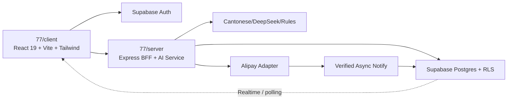

# 77vibe-dev-flow Context Pack

Generated: 2026-07-12T19:09:27
Project: D:\work\77港话通社媒文案\77

Use this file after context compaction, agent handoff, or thread restart.
Token rule: read `.planning/status.md` first; open this pack only when the status is not enough.

Resume order:
1. Read this context pack.
2. Re-open `.planning/task_plan.md`, `.planning/progress.md`, and `.planning/findings.md` if details are needed.
3. Continue only from documented PRD, SDD, TEST_PLAN, and acceptance evidence.
4. If the pack is stale, regenerate it before making decisions.

## README.md

```text
# 77港话通社媒文案器

香港粤语社媒文案 AI SaaS。当前仓库已经包含官网、匿名生成工作台和 Express AI 服务；账户、服务端数据、额度、支付和管理后台按 `spec/` 的切片顺序继续开发。

## 本地运行

```powershell
npm run dev
```

- 官网：`http://localhost:5173/`
- 工作台：`http://localhost:5173/app`
- API：`http://localhost:3001/api`

端口被占用时以 Vite/Express 终端输出为准。

## 验证

```powershell
cd client; npx tsc --noEmit; npm run build
cd ..\server; npx tsc --noEmit; npm run build
```

## 开发事实源

1. `spec/PRD.md`：MVP 范围和业务门禁。
2. `spec/SDD.md`：最终架构、页面、数据、接口和安全边界。
3. `spec/TEST_PLAN.md`：每个切片的严格证据要求。
4. `.planning/status.md`：当前状态和下一步。
5. `.planning/context_pack.md`：Claude Code/Codex 交接上下文。
6. `docs/design-system.md`：前端设计规范。
7. `docs/comprehensive-spec-v2.md`：生成域权威规格。

父目录项目导航：`D:\work\77港话通社媒文案\README.md`。

## 当前下一步

Slice A（正式路由 + 使用总览登录视觉的账户 Mock 壳）已完成并通过二次复测。

当前进入 Slice B：真实 Supabase Auth
[truncated: showing head]
```


## AGENTS.md

```text
# AGENTS.md

## Project Goal

交付一个可运行、可验证的香港粤语社媒文案 SaaS：公开邮箱账户、核心生成/审核/反馈、历史与收藏、Free/Pro 额度、支付宝沙箱支付和受审计的管理后台。

## Workflow

- Follow `AI_AGENT_PRODUCT_DEV_FLOW.md` or the installed `77vibe-dev-flow` skill.
- On first entry, prefer `vibe_start.py` to initialize missing files, refresh lean context, and write status.
- Read `README.md`, `spec/`, and `.planning/` before making changes.
- If `.planning/status.md` is stale or missing, generate it before deciding the next action.
- Regenerate `.planning/context_pack.md` before handoff, long pauses, or context-heavy work; use lean context for repeated loops.
- Generate `.planning/prompts/` handoff prompts before asking another agent to continue.
- Keep token use low: read status first, then only open full context or large evidence files when neede
[truncated: showing head]
```


## CLAUDE.md

```text
# CLAUDE.md

This file provides guidance to Claude Code (claude.ai/code) when working with code in this repository.

**本项目继承 `D:\vibecoding\claude\CLAUDE.md` 中的全部行为准则。** 遇到此处未覆盖的问题时，以上级文档为准。

## 2026-07-11 SaaS 交接入口

本仓库 `D:\work\77港话通社媒文案\77` 是唯一开发基线。不要把父目录的 `总览`、`dashboard` 或 `登录页` 另建成主产品。

开始任何新切片前依次读取：

1. `.planning/status.md`
2. `.planning/context_pack.md`
3. `spec/PRD.md`
4. `spec/SDD.md`
5. `spec/TEST_PLAN.md`
6. `D:\work\77港话通社媒文案\项目管理\03-ClaudeCode-第一阶段执行单.md`
7. `D:\work\77港话通社媒文案\开发日志\02-PRD-77港话通社媒文案器-SaaS.md`（完整 SaaS 产品需求）
8. `D:\work\77港话通社媒文案\开发日志\03-SPEC-77港话通社媒文案器-SaaS.md`（完整 SaaS 技术规格）
9. `docs/comprehensive-spec-v2.md`（文案生成工作台的领域权威规格）

交接文档和 `.planning` 文件只是执行摘要与当前状态索引，不能替代上述完整 PRD/SPEC。发生冲突时：用户最新确认 > `spec/PRD.md` > `spec/SDD.md` > 父目录完整 SaaS PRD/SPEC > `docs/comprehen
[truncated: showing head]
```


## PROMPTS.md

```text
# PROMPTS

Use these prompts to keep agent work aligned with 77vibe-dev-flow.

## Start New Product

```text
Use 77vibe-dev-flow. First clarify MVP, PRD, SDD, TEST_PLAN, harness, and acceptance. Do not code until the plan is aligned.
```

## Continue Existing Project

```text
Use 77vibe-dev-flow. Run vibe_start.py first, then read README, AGENTS.md, CLAUDE.md, spec/, .planning/, docs/evidence/, and docs/experience-library only as needed.
```

## Start Or Resume

```text
Use 77vibe-dev-flow. Run vibe_start.py with lean context, show me .planning/status.md, and recommend the next safe action.
```

## Check Status

```text
Use 77vibe-dev-flow. Generate .planning/status.md with vibe_status.py and tell me the current score, missing items, recent evidence, and next safe action.
```

## Add Requi
[truncated: showing head]
```


## spec/PRD.md

```text
# PRD：77港话通 SaaS MVP

状态：Slice A 已验收；用户已批准执行 Slice B 的真实 Auth/RLS、必要依赖安装、Supabase 项目连接和本切片数据库迁移。支付和生产部署仍受高风险门禁约束。完整业务 PRD 见 `..\..\开发日志\02-PRD-77港话通社媒文案器-SaaS.md`。

## PRD Gate

- 目标用户：需要把普通中文转成香港社媒表达的品牌市场人员、代理商和内容创作者。
- 当前痛点：通用翻译缺少港味、平台适配、品牌审核和可复用反馈闭环。
- MVP：官网、公开邮箱账户、生成/审核/反馈、历史/收藏、Free/Pro 额度、支付宝沙箱支付、基础后台。
- 不做：团队/席位/SSO、RAG、高级报表、自动发布社媒、生产支付直连。
- 核心指标：首次成功生成率、生成完成率、文案采用/复制率、7日复用、Free→Pro 沙箱闭环成功率。
- 风险门禁：数据库迁移、真实支付、权限和生产部署前必须获得明确确认。

Gate status：ready for prototype。Slice A 完成后，Slice B 进入 commercial strict work 前重新过门禁。

## One-Line Positioning

面向香港市场营销人员的 AI 社媒文案 SaaS：把普通中文诊断并重写成 5 类港式平台文案，再提供质量审核、消费者反馈和持续复用。

For 需要进入香港市场的品牌营销人员，77港话通是一款港式社媒文案 SaaS，通过诊断、5 类平台改写、质量审核和消费者反馈解决通用翻译不地道且难以定稿的问题。

## Target Users

- Who: 品牌市场人员、代理商内容团队和独立内容创作者。
- Current behavior: 使用通用大模型、翻译工具或人工粤语编辑，在多个工具间复制和
[truncated: showing head]
```


## spec/SDD.md

```text
# SDD：77港话通 SaaS MVP

完整目标设计见 `..\..\开发日志\03-SPEC-77港话通社媒文案器-SaaS.md`。本文件是 Claude Code 的当前实现入口。

## 架构结论



- 唯一代码基线：`77`。
- `总览`：只复用登录页视觉、Supabase/RLS/审计模式；不复用报销领域表和路由。
- 浏览器不可信：不能决定角色、任务归属、金额、额度或支付成功。
- Express BFF：校验 Supabase JWT、权限、额度、输入、幂等键和对象归属。
- 支付成功：只由验签后的异步通知写入业务数据库。

## 路由与页面

### 公开

`/`、`/pricing`、`/login`、`/signup`、`/forgot-password`、`/reset-password`、`/auth/callback`、`/billing/success`、`/billing/cancel`

### 用户
[truncated: showing head]
```


## spec/TEST_PLAN.md

```text
# TEST PLAN：77港话通 SaaS MVP

## 固定命令

```powershell
cd client; npx tsc --noEmit; npm run build
cd server; npx tsc --noEmit; npm run build
```

新增测试框架、浏览器自动化或安全扫描工具前先说明依赖并获得用户同意。

## 证据策略

| 区域 | 等级 | 最小证据 |
|---|---|---|
| 文档/索引 | basic | diff/进度记录 |
| 官网/工作台 UI | strict UI | 构建、桌面截图、交互/焦点说明 |
| Auth/Session/RLS | strict | 行为测试、浏览器证据、User A/B 隔离 |
| 生成持久化/额度 | strict | API/DB 状态、失败释放、幂等 |
| 支付/Webhook | strict | 沙箱请求、验签、重放、订单和权益状态 |
| 管理员/审计 | strict | 非管理员拒绝、正文访问/删除审计 |

## Slice A：账户壳 Mock

- `/`、`/login`、`/signup`、`/forgot-password`、`/reset-password` 可访问。
- 未登录访问 `/app` 重定向 `/login`。
- 合法 mock 登录后返回 `/app`；刷新恢复；退出后受保护页再次重定向。
- 非法邮箱、密码规则、必填、loading、disabled、错误和成功状态可见。
- 现有工作台仍渲染；生成相关类型检查和构建不回归。
- 截图：1440、1024、窄桌面；登录 loading/错误/成功三态。

## Slice B：真实 Auth 与 RLS

- 注册、邮箱验证、登录、错误密码、退出、忘记/重置、过期
[truncated: showing head]
```


## spec/ACCEPTANCE.md

```text
# Acceptance Criteria

## 2026-07-12 — Slice E 本地验收（权威状态）

| 验收项 | 结果 |
|---|---|
| 定价页 Free/Pro 双卡 + MOCK 标签 | ✅ 渲染测试通过 |
| 定价页价格、配额、功能列表、CTA 链接 | ✅ 全部渲染验证通过 |
| 定价页 FAQ 区 | ✅ 渲染测试通过 |
| 结算页受保护（需鉴权） | ✅ auth gate by ProtectedRoute |
| 结算页加载/空状态/错误/列表 | ✅ API client 测试覆盖 |
| POST /api/billing/checkout 校验 planId | ✅ 测试验证 |
| 原型链键不可绕过 planId allowlist | ✅ constructor / __proto__ / toString 均返回 400 |
| 前端篡改金额不改变订单金额 | ✅ 服务端仍按 Pro 定价返回 ¥19 |
| 拒绝 Free→Free + Pro→Free | ✅ 测试验证 |
| 成功创建 Mock 订单含 redirectUrl | ✅ 测试验证 |
| GET /api/billing/orders 按 userId 隔离 | ✅ User A/B 隔离测试 |
| GET /api/billing/orders/:id 拒绝非所有者 | ✅ 403 测试 |
| GET /api/billing/orders/:id 404 | ✅ 测试验证 |
| GET /api/billing/plans 公开无需鉴权 | ✅ 测试验证 |
| 支付结果页成功/取消状态 | ✅ 渲染 + 订单摘要测试 |
| 支付结果页缺少 orderId 错误态 | ✅ 错误消息测试 |
| 所有响应和页面含 isMock/
[truncated: showing head]
```


## spec/CHANGELOG.md

```text
[truncated: showing tail]
ed job loads; incomplete/failed job cannot masquerade as usable result
- Evidence: client behavior tests and browser smoke


## Proposed - 2026-07-12 - 四星收藏参考案例在工作台不可发现

- Type: bug
- Risk: low
- Why: 用户已有两条四星收藏，但生成区无法确认或选择参考案例；现有测试只验证入口存在，未覆盖云端水合与可用案例列表
- Verification: TBD
- Evidence: TBD


## Proposed - 2026-07-12 - 节日话题未覆盖五个平台版本

- Type: bug
- Risk: low
- Why: 用户在话题日历选择节日后，实际输出只有Shorts提及；全局Prompt虽存在强制指令，但缺少五版本输出覆盖验证与防回归测试
- Verification: TBD
- Evidence: TBD


## Proposed - 2026-07-12 - 官网Pricing与结算转化链路未接通

- Type: bug
- Risk: low
- Why: Pricing是孤立路由，官网套餐预览没有进入Pricing的链接，未登录用户点击Pro后也不能在登录后返回结算页
- Verification: TBD
- Evidence: TBD


## Proposed - 2026-07-12 - 已开发功能规格沉淀与防覆盖门禁

- Type: change
- Risk: low
- Why: 连续切片可能在新增页面或功能时弱化既有参考案例、话题注入、Header信息架构和转化链路
- Verification: TBD
- Evidence: TBD
```


## .planning/capability_router.md

```text
# Capability Router

This project uses `77vibe-dev-flow` as the controller.

Use this file to record which companion skills are relevant for this specific project. Do not call every skill by default.

## Selected Companion Skills

| Area | Skill or tool | Why it is relevant | Status |
|---|---|---|---|
| Product discovery | MVP_PROTOTYPE_AND_REUSE_FLOW | 固定最小可运行商业闭环和复用边界 | selected |
| PRD / stories / tests | 77vibe-dev-flow | PRD/SDD/严格证据与切片控制 | selected |
| Frontend / visual design | local `docs/design-system.md` | 登录复用与工作台视觉一致 | selected |
| Architecture / code quality | COMMERCIAL_SAAS_FLOW + SECURITY_ENGINEERING_GATE | Auth、数据、支付、后台架构与门禁 | selected |
| Context / memory | context_pack + prompt | Claude Code 交接和 compact 恢复 | selected |
| Analytics / business proof | TBD | TBD | candidat
[truncated: showing head]
```


## .planning/insight.md

```text
# Project Insight

Generated: 2026-07-11T11:13:37
Project: D:\work\77港话通社媒文案\77

## Readiness

- Score: 79/100
- State: usable with known gaps
- Purpose: compact local diagnosis for product alignment, verification, context hygiene, and loop safety.

## Risk Signals

- HIGH: Recent evidence includes failures - 1 saved test output file(s) look failed. Next: Fix or explain failures before acceptance.
- LOW: Capability router has many TBD rows - 4 router rows still contain TBD. Next: Resolve only the rows relevant to the current slice.

## Product Insight

- spec/PRD.md: has usable content, placeholders=0
- spec/SDD.md: has usable content, placeholders=0
- spec/TEST_PLAN.md: has usable content, placeholders=0
- spec/ACCEPTANCE.md: has usable content, placeholders=0
- spec/CHANGELOG.md: has usa
[truncated: showing head]
```


## .planning/prd_gate.md

Missing.


## scripts/verify/commands.md

```text
# Verification Commands

Generated: 2026-07-11T10:04:06
Project: D:\work\77港话通社媒文案\77

## Detected Stack

- node

## Recommended Order

1. Install dependencies when needed.
2. Run fast static checks.
3. Run behavior tests for the changed slice.
4. Run build, smoke, or integration checks when the slice touches UI, API, auth, data, or deployment paths.
5. Save the command output with `vibe_loop.py` or `vibe_verify.py`.

## Commands

| Purpose | Command | Required | Notes |
|---|---|---:|---|
| install dependencies | `npm install` | when needed | Detected npm. |
| production build | `npm run build` | yes | package.json script `build`. |
| local dev server | `npm run dev` | recommended | package.json script `dev`. |

## Loop Usage

```text
python path/to/vibe_loop.py . --name "verify current s
[truncated: showing head]
```


## .planning/task_plan.md

```text
# Task Plan

## Current checkpoint — 2026-07-12

- Slice D cloud sync is **COMPLETE locally and remotely**. 3 tables + 7 API endpoints + mutation sync/outbox + hydration/retry + explicit legacy import. Migration pushed and RLS/limit transaction smoke passed.
- Slice C2a/C2b is complete locally and remotely.
- Workbench usability polish is complete: history back-navigation, collapsed note summaries, collapsible reference cases, and signup confirmation loading/copy.
- Next candidate: Spec v2.1 F1 simulated generation progress (diagnosis → generation → audit → feedback). After F1, continue with Slice E payment/order mock. Real Alipay integration remains a separate high-risk gate and requires explicit user approval.
- Pricing: Free 20 successful full-generation workflows per rolling 7 days; Pr
[truncated: showing head]
```


## .planning/agent_assessment.md

```text
# Agent Assessment

Use this file to record whether a task should run as:

- solo
- single-agent-with-review-subagent
- sequential-subagents
- parallel-subagents

For parallel implementation, prefer isolated git worktrees when the project is a git repository and tasks do not edit the same files.

Before running `sequential-subagents` or `parallel-subagents`, ask the user for approval and record the approval in this file.

## 2026-07-11 - Slice B Supabase Auth RLS with Agent Teams

- Project: D:\work\77港话通社媒文案\77
- Risk: high
- Estimated files: 20
- Domains: frontend, backend, database, testing
- Independent tasks: 3
- Shared files: False
- Git repository: True
- Score: 12
- Recommended mode: parallel-subagents
- Use subagents: True
- Use git worktree: True
- Requires user approval before m
[truncated: showing head]
```


## .planning/status.md

```text
# Project Status

## Current Override — 2026-07-12

- Slice B、C1、C2a/C2b、D 已完成远端闭环。
- **UX-F1 已完成：四阶段预估生成进度 + Header 菜单收纳。**
- **Slice H1-R 已完成并推送数据库前置：反馈安全修复 + 工作台会话恢复 + 历史载入。**
- 当前自动化基线：Server 306/306、Client 198/198，双端 TS/build 通过。
- Slice H1 Migration `20260712072936_slice_h1_user_feedback.sql` 已通过认证 Supabase MCP 推送；表、RLS、策略、授权与触发器已验证。待浏览器提交一条反馈完成端到端验收。
- 用户已于 2026-07-12 授权进入下一步 Claude Code 开发；Slice E 套餐/订单/支付 Mock 已完成。下一步：Slice F 支付宝沙箱（需商户与计费决策）或 Slice G 管理后台。所有支付/生产动作仍需单独授权。

## Current checkpoint — 2026-07-12 (Final)

- Slice D cloud sync: **DONE — 3rd round audit fixes complete.**
- Migration: `20260712070000_slice_d_cloud_sync.sql` with octet_length checks, varchar(100)[] reason_tags, atomic 20 trigger.
- Server: 201/201 tests (4 files). Route validation complete. Error messages s
[truncated: showing head]
```


## .planning/loop_stop.md

```text
# Loop Stop — H1 Migration Push

Date: 2026-07-12

## Goal

Push `20260712143000_slice_h1_user_feedback.sql` to the linked Supabase project after explicit user authorization.

## Attempts

1. `npx supabase migration list` — failed before remote version discovery with `LegacyDbConnectError`.
2. `npx supabase db push` — failed during remote Postgres TLS negotiation with EOF.

## What Changed

- No remote database change is evidenced; the CLI never reached migration application output.
- Local migration file was not modified.

## Blocker

The current machine cannot establish the Supabase CLI Postgres TLS connection to `db.qiotocumkbwckiezuptr.supabase.co`.

## Needed Decision

Choose either Supabase Dashboard SQL Editor / authenticated Supabase MCP as the alternative application path, or firs
[truncated: showing head]
```


## .planning/loop_log.md

```text
# Loop Log

## 2026-07-12 — Slice H1-R: Feedback security fix + Session restore + History load

- Phase: implement (local-only, no push/deploy/db migration)
- Goal: Fix all issues from independent review (A1-A8, B1-B4, C1-C4) + evidence D
- Goal state: achieved
- Exit code: 0
- Tests: Server 282/282 (+29), Client 164/164 (+5), TS --noEmit clean both sides
- Key changes: SendKey parser (case-insensitive, multi-line fail-closed, quoted), trusted notify update (keep pending on error), DB rate-limit trigger (advisory lock, 20/hr), migration permission hardening, FeedbackCenter a11y (dialog/aria/focus-trap/Escape), user-friendly error messages, sessionStorage snapshot (owner-scoped), history "load to workbench"
- Evidence: docs/evidence/2026-07-12/slice-H1-R/
- Blocker: Migration NOT pushed (re
[truncated: showing head]
```


## .planning/findings.md

```text
# Findings

## Slice H1-R Findings — 2026-07-12

- sessionStorage 快照恢复必须配合测试 beforeEach 清理 `ssStore.clear()`，否则跨测试残留会导致 `SET_ERROR → variants 应为 null` 断言失败。
- `Notifier` 接口增加可选 `isConfigured?()` 方法避免破坏现有 NoopNotifier 使用者；测试使用 `?.()` 调用。
- Migration trigger 中的 advisory lock key 计算使用 `hashtext` 衍生，跨 uuid 碰撞概率极低但在极端场景下可能误串行化；生产环境建议在 `pg_stat_user_tables` 确认无实际碰撞。
- DB trigger `RATE_LIMIT` 错误通过 `P0001` (raise_exception) 传播到 BFF，BFF 做模式匹配映射到 429；这种方式只在 INSERT 阶段生效，不影响 SELECT/UPDATE。
- `FeedbackCenter` 焦点管理在测试环境下 `jsdom` 不完全支持 `document.activeElement` 赋值，初始焦点测试使用 `waitFor` + `toHaveFocus` 需确保 close button ref 已挂载。

## Slice D Final Findings — 2026-07-12

- 实测跨账号收藏问题包含客户端旧 global localStorage 导入风险；现在改为账号命名空间 + 明示导入/跳过。
- 仅有 RLS 不足以保证业务上限；配置 20 条上限由数据库 trigger 原子执行，不能依赖 Express 的 count-then-insert
[truncated: showing head]
```


## .planning/progress.md

```text
[truncated: showing tail]
 recorded bug request `反馈提交返回 Internal server error` with high risk.

- 2026-07-12: recorded bug request `进入生成历史后工作台结果丢失` with medium risk.

- 2026-07-12: recorded feature request `从生成历史载入工作台` with medium risk.

- 2026-07-12: ✅ **completed + independently reviewed** Slice E 套餐/订单/支付 Mock — 补齐显式 plan allowlist、可信金额测试、BillingPage 渲染测试，将结算入口收纳至 HeaderMenu；用户参考 Logo 已在四处统一裁切白边。Server 306/306，Client 198/198，双端 tsc/build 和本地运行烟测通过。纯内存 Mock，不走真实支付宝/DB Migration/远端订单。证据：`docs/evidence/2026-07-12/slice-E/verification.md`。

- 2026-07-12: recorded bug request `四星收藏参考案例在工作台不可发现` with low risk.

- 2026-07-12: recorded bug request `节日话题未覆盖五个平台版本` with low risk.

- 2026-07-12: recorded bug request `官网Pricing与结算转化链路未接通` with low risk.

- 2026-07-12: recorded change request `已开发功能规格沉淀与防覆盖门禁` with low risk.
```


## Recent Evidence Files

- docs\evidence\2026-07-12\slice-E\verification.md (3811 bytes)
- docs\evidence\2026-07-12\slice-E\server-tests.txt (0 bytes)
- docs\evidence\2026-07-12\slice-H1-R\verification.md (8577 bytes)
- docs\evidence\2026-07-12\slice-H1-R\test-output.txt (546 bytes)
- docs\evidence\2026-07-12\slice-H1-R\client-tests.txt (0 bytes)
- docs\evidence\2026-07-12\slice-H1-R\server-tests.txt (0 bytes)
- docs\evidence\2026-07-12\slice-H1\verification.md (2425 bytes)
- docs\evidence\2026-07-12\slice-H1\server-test-output.txt (232 bytes)
- docs\evidence\2026-07-12\slice-ux-f1\notes.md (5114 bytes)
- docs\evidence\2026-07-12\slice-ui-polish\notes.md (668 bytes)
- docs\evidence\2026-07-12\slice-D-cloud-sync\notes.md (7989 bytes)
- docs\evidence\2026-07-12\slice-C2b-remote\notes.md (2020 bytes)


## Recent Experience Library Files

- docs\experience-library\README.md (276 bytes)
