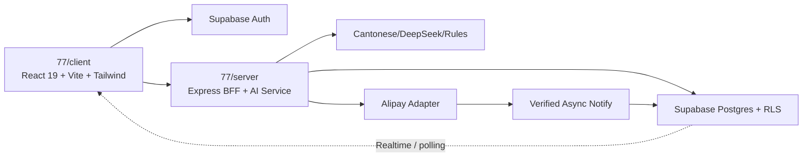

# 77vibe-dev-flow Context Pack

Generated: 2026-07-15T17:06:20
Project: D:\work\77港话通社媒文案\77

Use this file after context compaction, agent handoff, or thread restart.
Token rule: read `.planning/status.md` first; open this pack only when the status is not enough.

Resume order:
1. Read this context pack.
2. Re-open `.planning/task_plan.md`, `.planning/progress.md`, and `.planning/findings.md` if details are needed.
3. Continue only from documented PRD, SDD, TEST_PLAN, and acceptance evidence.
4. If the pack is stale, regenerate it before making decisions.

## README.md

```text
# 77港话通社媒文案器

香港粤语社媒文案 AI SaaS。当前仓库已经包含官网、匿名生成工作台和 Express AI 服务；账户、服务端数据、额度、支付和管理后台按 `spec/` 的切片顺序继续开发。

## 本地运行

```powershell
npm run dev
```

- 官网：`http://localhost:5173/`
- 工作台：`http://localhost:5173/app`
- API：`http://localhost:3001/api`

端口被占用时以 Vite/Express 终端输出为准。

## 验证

```powershell
cd client; npx tsc --noEmit; npm run build
cd ..\server; npx tsc --noEmit; npm run build
```

## 开发事实源

1. `spec/PRD.md`：MVP 范围和业务门禁。
2. `spec/SDD.md`：最终架构、页面、数据、接口和安全边界。
3. `spec/TEST_PLAN.md`：每个切片的严格证据要求。
4. `.planning/status.md`：当前状态和下一步。
5. `.planning/context_pack.md`：Claude Code/Codex 交接上下文。
6. `docs/design-system.md`：前端设计规范。
7. `docs/comprehensive-spec-v2.md`：生成域权威规格。

父目录项目导航：`D:\work\77港话通社媒文案\README.md`。

## 当前下一步

Slice A（正式路由 + 使用总览登录视觉的账户 Mock 壳）已完成并通过二次复测。

当前进入 Slice B：真实 Supabase Auth
[truncated: showing head]
```


## AGENTS.md

```text
# AGENTS.md

## Project Goal

交付一个可运行、可验证的香港粤语社媒文案 SaaS：公开邮箱账户、核心生成/审核/反馈、历史与收藏、Free/Pro 额度、支付宝沙箱支付和受审计的管理后台。

## Workflow

- Follow `AI_AGENT_PRODUCT_DEV_FLOW.md` or the installed `77vibe-dev-flow` skill.
- On first entry, prefer `vibe_start.py` to initialize missing files, refresh lean context, and write status.
- Read `README.md`, `spec/`, and `.planning/` before making changes.
- If `.planning/status.md` is stale or missing, generate it before deciding the next action.
- Regenerate `.planning/context_pack.md` before handoff, long pauses, or context-heavy work; use lean context for repeated loops.
- Generate `.planning/prompts/` handoff prompts before asking another agent to continue.
- Keep token use low: read status first, then only open full context or large evidence files when neede
[truncated: showing head]
```


## CLAUDE.md

```text
# CLAUDE.md

This file provides guidance to Claude Code (claude.ai/code) when working with code in this repository.

**本项目继承 `D:\vibecoding\claude\CLAUDE.md` 中的全部行为准则。** 遇到此处未覆盖的问题时，以上级文档为准。

## 2026-07-11 SaaS 交接入口

本仓库 `D:\work\77港话通社媒文案\77` 是唯一开发基线。不要把父目录的 `总览`、`dashboard` 或 `登录页` 另建成主产品。

开始任何新切片前依次读取：

1. `.planning/status.md`
2. `.planning/context_pack.md`
3. `spec/PRD.md`
4. `spec/SDD.md`
5. `spec/TEST_PLAN.md`
6. `D:\work\77港话通社媒文案\项目管理\03-ClaudeCode-第一阶段执行单.md`
7. `D:\work\77港话通社媒文案\开发日志\02-PRD-77港话通社媒文案器-SaaS.md`（完整 SaaS 产品需求）
8. `D:\work\77港话通社媒文案\开发日志\03-SPEC-77港话通社媒文案器-SaaS.md`（完整 SaaS 技术规格）
9. `docs/comprehensive-spec-v2.md`（文案生成工作台的领域权威规格）

交接文档和 `.planning` 文件只是执行摘要与当前状态索引，不能替代上述完整 PRD/SPEC。发生冲突时：用户最新确认 > `spec/PRD.md` > `spec/SDD.md` > 父目录完整 SaaS PRD/SPEC > `docs/comprehen
[truncated: showing head]
```


## PROMPTS.md

```text
# PROMPTS

Use these prompts to keep agent work aligned with 77vibe-dev-flow.

## Start New Product

```text
Use 77vibe-dev-flow. First clarify MVP, PRD, SDD, TEST_PLAN, harness, and acceptance. Do not code until the plan is aligned.
```

## Continue Existing Project

```text
Use 77vibe-dev-flow. Run vibe_start.py first, then read README, AGENTS.md, CLAUDE.md, spec/, .planning/, docs/evidence/, and docs/experience-library only as needed.
```

## Start Or Resume

```text
Use 77vibe-dev-flow. Run vibe_start.py with lean context, show me .planning/status.md, and recommend the next safe action.
```

## Check Status

```text
Use 77vibe-dev-flow. Generate .planning/status.md with vibe_status.py and tell me the current score, missing items, recent evidence, and next safe action.
```

## Add Requi
[truncated: showing head]
```


## spec/PRD.md

```text
# PRD：77港话通 SaaS MVP

> 2026-07-14 待开发需求：工作台内容控制与个人案例库。案例标题为选填；普通管理员可受审计地查看收藏正文，超级管理员额外可受审计地查看案例正文。详情及验收范围见 spec/WORKBENCH_CONTENT_CONTROLS.md。

状态：Slice A 已验收；用户已批准执行 Slice B 的真实 Auth/RLS、必要依赖安装、Supabase 项目连接和本切片数据库迁移。支付和生产部署仍受高风险门禁约束。完整业务 PRD 见 `..\..\开发日志\02-PRD-77港话通社媒文案器-SaaS.md`。

## PRD Gate

- 目标用户：需要把普通中文转成香港社媒表达的品牌市场人员、代理商和内容创作者。
- 当前痛点：通用翻译缺少港味、平台适配、品牌审核和可复用反馈闭环。
- MVP：官网、公开邮箱账户、生成/审核/反馈、历史/收藏、Free/Pro 额度、支付宝沙箱支付、基础后台。
- 不做：团队/席位/SSO、RAG、高级报表、自动发布社媒、生产支付直连。
- 核心指标：首次成功生成率、生成完成率、文案采用/复制率、7日复用、Free→Pro 沙箱闭环成功率。
- 风险门禁：数据库迁移、真实支付、权限和生产部署前必须获得明确确认。

Gate status：ready for prototype。Slice A 完成后，Slice B 进入 commercial strict work 前重新过门禁。

## One-Line Positioning

面向香港市场营销人员的 AI 社媒文案 SaaS：把普通中文诊断并重写成 5 类港式平台文案，再提供质量审核、消费者反馈和持续复用。

For 需要进入香港市场的品牌营销人员，77港话通是一款港式社媒文案 SaaS，通过诊断、5 类平台改写、质量审核
[truncated: showing head]
```


## spec/SDD.md

```text
# SDD：77港话通 SaaS MVP

> 2026-07-14 待开发架构增量：文案类型、可选长度控制、主/修饰语气、个人案例库与 Prompt 注入。具体数据与权限边界见 spec/WORKBENCH_CONTENT_CONTROLS.md；未实施。

完整目标设计见 `..\..\开发日志\03-SPEC-77港话通社媒文案器-SaaS.md`。本文件是 Claude Code 的当前实现入口。

## 架构结论



- 唯一代码基线：`77`。
- `总览`：只复用登录页视觉、Supabase/RLS/审计模式；不复用报销领域表和路由。
- 浏览器不可信：不能决定角色、任务归属、金额、额度或支付成功。
- Express BFF：校验 Supabase JWT、权限、额度、输入、幂等键和对象归属。
- 支付成功：只由验签后的异步通知写入业务数据库。

## 托管与跨域（2026-07-14 本地 readiness）

- **部署
[truncated: showing head]
```


## spec/TEST_PLAN.md

```text
# TEST PLAN：77港话通 SaaS MVP

> 待开发测试范围：工作台内容控制与个人案例库。以 spec/WORKBENCH_CONTENT_CONTROLS.md 第 6 节的 W1–W4 验收矩阵为准；远端 Migration/RLS 需单独授权。

## 固定命令（Phase 0 起）

安装与构建分离；**禁止**在 `build` 内执行 `npm ci`。

```powershell
# 依赖变更后
npm ci
# 或
npm run install:all

# 单元 / 行为
npm run test:client    # 期望 ≥358（含 apiBase）
npm run test:server    # 期望 ≥521（含 CORS + alipayUrls）

# 类型与生产构建
npm run typecheck
npm run build

# 安全门禁
npm run audit:prod     # 无 high/critical
npm run audit:all      # 无 high/critical

# 一键（含 audit）
npm run verify

# 可选：公开页 smoke（需先 dev:client + playwright install chromium）
npm run test:e2e:smoke
```

等价分项：

```powershell
cd client; npx vitest run; npx tsc --noEmit; npm run build
cd server; npm test; npx tsc --noEmit; npm run build
```

Playwright 仅 Phase 0 smoke；完整业务 E2E 见 `docs/release/202
[truncated: showing head]
```


## spec/ACCEPTANCE.md

```text
# Acceptance Criteria

## 2026-07-14 — R1.1 审核保存热修复与正文审阅可达性

| 门禁 | 状态 |
| --- | --- |
| 追加 Migration，不改已推送 R1 | ✅ 本地 `20260714190100` |
| 两处 `audit_log.actor_role` 显式转换为 `public.app_role` | ✅ 静态契约测试 |
| RPC 继续 `SECURITY DEFINER` + 空 `search_path` | ✅ |
| RPC 仅 `service_role` 可执行 | ✅ |
| 正文框可纵向拉伸、内部滚动且有操作提示 | ✅ |
| 主内容区可滚动；关闭与复制操作可达 | ✅ |
| 保存错误使用 `role="alert"` | ✅ |
| 客户端全量测试 | ✅ 365/365 |
| 服务端全量测试 | ✅ 551/551 |
| 双端 TypeScript、生产构建、依赖审计 | ✅ |
| 远端 Migration 推送 | ✅ `qiotocumkbwckiezuptr` 已应用 `20260714190100` |
| 远端 RPC 事务验证 | ✅ `candidate_count=1`、`rpc_ok=true`、`status_ok=true`；验证后回滚 |
| 浏览器管理员保存复验 | ⏳ 请用户刷新管理页后操作一次 |

证据：`docs/evidence/2026-07-14/r1-review-save-hotfix/verification.md`

## 2026-07-14 — R1 审核分组 + 管理员收藏批注

| 门禁 | 状态 |
| --- | --- |
| `profiles.review_group` + CHECK/索引 | ✅
[truncated: showing head]
```


## spec/CHANGELOG.md

```text
[truncated: showing tail]
bytes，减少约 45%，Vite 超过 500 kB 的警告消失。
- 路由匹配、Provider 层级、鉴权、支付和业务状态保持不变。
- 验证：Client 393/393、TypeScript、production build、三个主路径 HTTP 200 均通过。
- 证据：`docs/evidence/2026-07-15/route-code-splitting/verification.md`

# 2026-07-15 - Phase 0 CI 与 Migration 基线

- 新增 Supabase CLI 本地配置，统一本地 Auth 5173 回调并启用 migration harness。
- 新增 GitHub Actions CI：锁定安装、双端测试、类型检查、构建及两次依赖审计。
- CI 使用只读 Token、固定官方 Action SHA，不读取 secrets、不部署、不写数据库。
- linked Supabase Migration history 15/15 完全对齐，不需要 repair。
- 验证：Client 400/400、Server 571/571、双端 typecheck/build、两次 audit 0 vulnerabilities。
- 未执行：Git commit/push、GitHub 线上 CI、staging 创建/重放、Migration 写入、部署或真实支付。

## Phase 0 在线验证更新

- 基线与 Node 22 修复已提交并推送至 `origin/master`。
- GitHub Actions 最终运行 `29403089055` 全绿；官方 Actions 已更新为固定 SHA 的 v5。
- 仍未执行 staging 创建/重放、Migration 写入、部署或真实支付。
```


## .planning/capability_router.md

```text
# Capability Router

This project uses `77vibe-dev-flow` as the controller.

Use this file to record which companion skills are relevant for this specific project. Do not call every skill by default.

## Selected Companion Skills

| Area | Skill or tool | Why it is relevant | Status |
|---|---|---|---|
| Product discovery | MVP_PROTOTYPE_AND_REUSE_FLOW | 固定最小可运行商业闭环和复用边界 | selected |
| PRD / stories / tests | 77vibe-dev-flow | PRD/SDD/严格证据与切片控制 | selected |
| Frontend / visual design | local `docs/design-system.md` | 登录复用与工作台视觉一致 | selected |
| Architecture / code quality | COMMERCIAL_SAAS_FLOW + SECURITY_ENGINEERING_GATE | Auth、数据、支付、后台架构与门禁 | selected |
| Context / memory | context_pack + prompt | Claude Code 交接和 compact 恢复 | selected |
| Analytics / business proof | TBD | TBD | candidat
[truncated: showing head]
```


## .planning/insight.md

```text
# Project Insight

Generated: 2026-07-11T11:13:37
Project: D:\work\77港话通社媒文案\77

## Readiness

- Score: 79/100
- State: usable with known gaps
- Purpose: compact local diagnosis for product alignment, verification, context hygiene, and loop safety.

## Risk Signals

- HIGH: Recent evidence includes failures - 1 saved test output file(s) look failed. Next: Fix or explain failures before acceptance.
- LOW: Capability router has many TBD rows - 4 router rows still contain TBD. Next: Resolve only the rows relevant to the current slice.

## Product Insight

- spec/PRD.md: has usable content, placeholders=0
- spec/SDD.md: has usable content, placeholders=0
- spec/TEST_PLAN.md: has usable content, placeholders=0
- spec/ACCEPTANCE.md: has usable content, placeholders=0
- spec/CHANGELOG.md: has usa
[truncated: showing head]
```


## .planning/prd_gate.md

Missing.


## scripts/verify/commands.md

```text
# Verification Commands

Generated: 2026-07-14  
Project: `D:\work\77港话通社媒文案\77`

## 原则

1. **安装与构建分离**：`build` 脚本内不得执行 `npm ci` / `npm install`。
2. 先装依赖，再 test → typecheck → build → audit。
3. 高风险（db push / 部署 / 支付生产）不在本文件默认命令内。

## 推荐顺序（Phase 0 / CI）

```powershell
# 1. Install (once per clean checkout or lockfile change)
npm run install:all
# 等价：npm ci

# 2. Tests
npm run test:client
npm run test:server
# 或：npm test

# 3. Typecheck
npm run typecheck:client
npm run typecheck:server
# 或：npm run typecheck

# 4. Build (no install inside)
npm run build:client
npm run build:server
# 或：npm run build

# 5. Dependency audit
npm run audit:prod
npm run audit:all

# 6. One-shot gate
npm run verify

# 7. Optional public homepage smoke (requires dev:client on :5173)
npm run test:e2e:smoke
```

## 2026
[truncated: showing head]
```


## .planning/task_plan.md

```text
# Task Plan

## 2026-07-15 Phase 0 CI / Migration checkpoint

- **已完成本地：** `supabase/config.toml`、只读 GitHub Actions CI、安全静态门禁。
- **已只读验证：** linked Migration history 15/15 本地远端一致，旧 W2 漂移已关闭，无需 repair。
- **已验证：** Client 400/400、Server 571/571、双端 typecheck/build、两次 audit 0 vulnerabilities。
- **已完成远端 Git：** Phase 0 基线与 Node 22 CI 修复已 push；GitHub Actions `29403089055` 全绿。
- **仍待授权/外部状态：** 创建独立 staging Supabase 并从零重放 migrations。
- **下一小切片建议：** 在不连接生产数据的前提下准备 Playwright 稳定运行和完整浏览器 E2E 用例分层；staging 创建与部署另行确认。

## 2026-07-14 生产上线门禁复审

- 结论：**尚未达到生产部署条件**；本地核心回归通过，但真实支付宝 sandbox E2E、浏览器 E2E、migration history 对齐、依赖安全、staging/CI、Auth 邮件与运维闭环仍为阻断项。
- 本轮实测：Client 353/353、Server 509/509、双端 production build 通过。
- 新发现：本地/远端 W2 migration 时间戳不一致；production audit 仍有 `form-data` high，完整 audit 另有 `concurrently`
[truncated: showing head]
```


## .planning/agent_assessment.md

```text
# Agent Assessment

Use this file to record whether a task should run as:

- solo
- single-agent-with-review-subagent
- sequential-subagents
- parallel-subagents

For parallel implementation, prefer isolated git worktrees when the project is a git repository and tasks do not edit the same files.

Before running `sequential-subagents` or `parallel-subagents`, ask the user for approval and record the approval in this file.

## 2026-07-11 - Slice B Supabase Auth RLS with Agent Teams

- Project: D:\work\77港话通社媒文案\77
- Risk: high
- Estimated files: 20
- Domains: frontend, backend, database, testing
- Independent tasks: 3
- Shared files: False
- Git repository: True
- Score: 12
- Recommended mode: parallel-subagents
- Use subagents: True
- Use git worktree: True
- Requires user approval before m
[truncated: showing head]
```


## .planning/status.md

```text
# Project Status

Generated: 2026-07-15T16:56:51
Project: D:\work\77港话通社媒文案\77

## Workflow Score

- Score: 100/100
- Present items: 18
- Missing items: 0

## Current Phase

**PHASE 0 COMPLETE —** CI 与 Supabase local harness 已完成并推送；GitHub Actions `29403089055` 全绿。下一开发切片为 Playwright 浏览器 E2E 准备。

## Missing Items

- none

## Evidence Summary

- Evidence outputs: 18
- Passed: 7
- Failed: 2
- Unknown: 9

## Recent Evidence

- `docs\evidence\2026-07-15\phase0-ci-migration-baseline\test-output.txt`: pass (0)
- `docs\evidence\2026-07-15\slice-06\test-output.txt`: pass (0)
- `docs\evidence\2026-07-15\slice-05\test-output.txt`: fail (2)
- `docs\evidence\2026-07-15\slice-04\test-output.txt`: fail (2)
- `docs\evidence\2026-07-15\slice-03\test-output.txt`: pass (0)
- `docs\evidence\2026-07-15\slice-02
[truncated: showing head]
```


## .planning/loop_stop.md

```text
# Loop Stop — H1 Migration Push

Date: 2026-07-12

## Goal

Push `20260712143000_slice_h1_user_feedback.sql` to the linked Supabase project after explicit user authorization.

## Attempts

1. `npx supabase migration list` — failed before remote version discovery with `LegacyDbConnectError`.
2. `npx supabase db push` — failed during remote Postgres TLS negotiation with EOF.

## What Changed

- No remote database change is evidenced; the CLI never reached migration application output.
- Local migration file was not modified.

## Blocker

The current machine cannot establish the Supabase CLI Postgres TLS connection to `db.qiotocumkbwckiezuptr.supabase.co`.

## Needed Decision

Choose either Supabase Dashboard SQL Editor / authenticated Supabase MCP as the alternative application path, or firs
[truncated: showing head]
```


## .planning/loop_log.md

```text
# Loop Log

## 2026-07-14 — local-vercel-readiness + homepage scroll smoke

- Phase: implement (local config/code only; no deploy/migration/secret/commit)
- Goal: e2e scroll reveal smoke; configurable API origin; CORS allowlist; split alipay return/notify URLs; dual-project Vercel json + docs
- Goal state: achieved (local)
- Exit code: 0
- Tests: E2E smoke 2/2; Client 358/358; Server 526/526; typecheck + build; audit 0 vulns; vercel.json JSON OK; secret scan clean (no real keys)
- Evidence: docs/evidence/2026-07-14/local-vercel-readiness/verification.md
- Explicitly NOT done: cloud deploy CLI, migration, real env values, alipay E2E, git commit/push
- Stop: slice complete

## 2026-07-14 — Phase 0 生产发布基线

- Phase: implement (engineering baseline only; no deploy/migration write/commit)
- Goal
[truncated: showing head]
```


## .planning/findings.md

```text
# Findings

## Slice G1 (A/B/C/D/E) Findings — 2026-07-12

### Architecture Decisions

- **ReferenceCaseSelector**: Already always visible and correct. Added 13 new tests covering hydration, selection toggle, max-3 constraint, and cross-account isolation.
- **Calendar coverage**: Prompt already has 🚨 mandatory 5-platform instruction. Added 13 new tests covering DeepSeek/Cantonese LLM prompt builders, fallback engine, and prompt contract validation. Exported `buildCalendarEventsSection` for testability.
- **Pricing/Billing**: Already correct — PricingPage plan content, CTA links, nextPath security, MarketingPage nav links, HeaderMenu billing entry all in place. Verified with existing tests.
- **Regression matrix**: Created `.planning/regression_matrix.md` with 12 domains, 11 anti-regression
[truncated: showing head]
```


## .planning/progress.md

```text
[truncated: showing tail]
入口 JS 从 857,028 bytes 降至 471,335 bytes（约 -45%），Vite 500 kB 警告消失。Client 393/393、typecheck/build、`/`/`/admin`/`/app` 200 通过。Grok Build 只读审阅连续两次仅返回 CLI 警告、无有效结论，按上限停止且未改文件。无安装、Migration、远端写入、真实支付、部署、commit/push/reset/clean/Worktree。

- 2026-07-15：✅ **Phase 0 CI 与 Migration 基线本地完成** — 新增 Supabase CLI 本地配置和只读 GitHub Actions CI；官方 Actions 固定 SHA，Token 仅 `contents: read`，不引用 secrets、不部署、不执行 DB 写入。linked Migration history 15/15 完全一致，无需 repair。Client 400/400、Server 571/571、双端 typecheck/build、两次 audit 0 vulnerabilities。workflow 尚未 commit/push，GitHub 线上运行与 staging 从零重放未验证。

- 2026-07-15：✅ **Phase 0 GitHub CI 在线验证完成** — 首次 Node 20 运行因 Supabase Realtime 缺原生 WebSocket 失败；最小修复为 CI Node 22。随后将 checkout/setup-node 更新到固定 SHA 的 v5，最终 run `29403089055` 全绿且无旧 runtime 弃用警告。基线已推送；仍未 staging、部署、Migration 写入或真实支付。
```


## Recent Evidence Files

- docs\evidence\2026-07-15\phase0-ci-migration-baseline\test-output.txt (256 bytes)
- docs\evidence\2026-07-15\phase0-ci-migration-baseline\verification.md (2419 bytes)
- docs\evidence\2026-07-15\homepage-login-v4-review\acceptance.md (1151 bytes)
- docs\evidence\2026-07-15\homepage-login-v4-review\loader-77-orange-green.png (15828 bytes)
- docs\evidence\2026-07-15\homepage-login-v4-review\login-semantic-lines-mobile.png (320507 bytes)
- docs\evidence\2026-07-15\homepage-login-v4-review\login-semantic-lines-desktop.png (1093772 bytes)
- docs\evidence\2026-07-15\homepage-login-v4-review\home-terminal-enlarged-mobile.png (114917 bytes)
- docs\evidence\2026-07-15\homepage-login-v4-review\home-terminal-enlarged-desktop.png (223351 bytes)
- docs\evidence\2026-07-15\homepage-login-v4-review\home-mobile-full.png (1150814 bytes)
- docs\evidence\2026-07-15\homepage-login-v4-review\home-desktop-full.png (2202943 bytes)
- docs\evidence\2026-07-15\homepage-login-v4-review\loader-77.png (14579 bytes)
- docs\evidence\2026-07-15\homepage-login-v4-review\login-mobile-final.png (316872 bytes)


## Recent Experience Library Files

- docs\experience-library\README.md (276 bytes)
