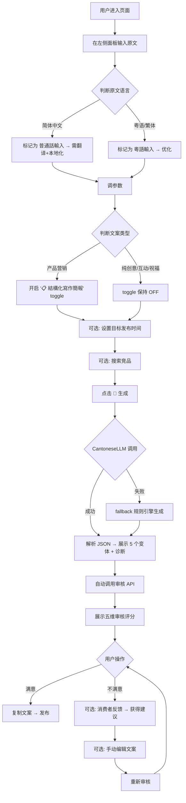
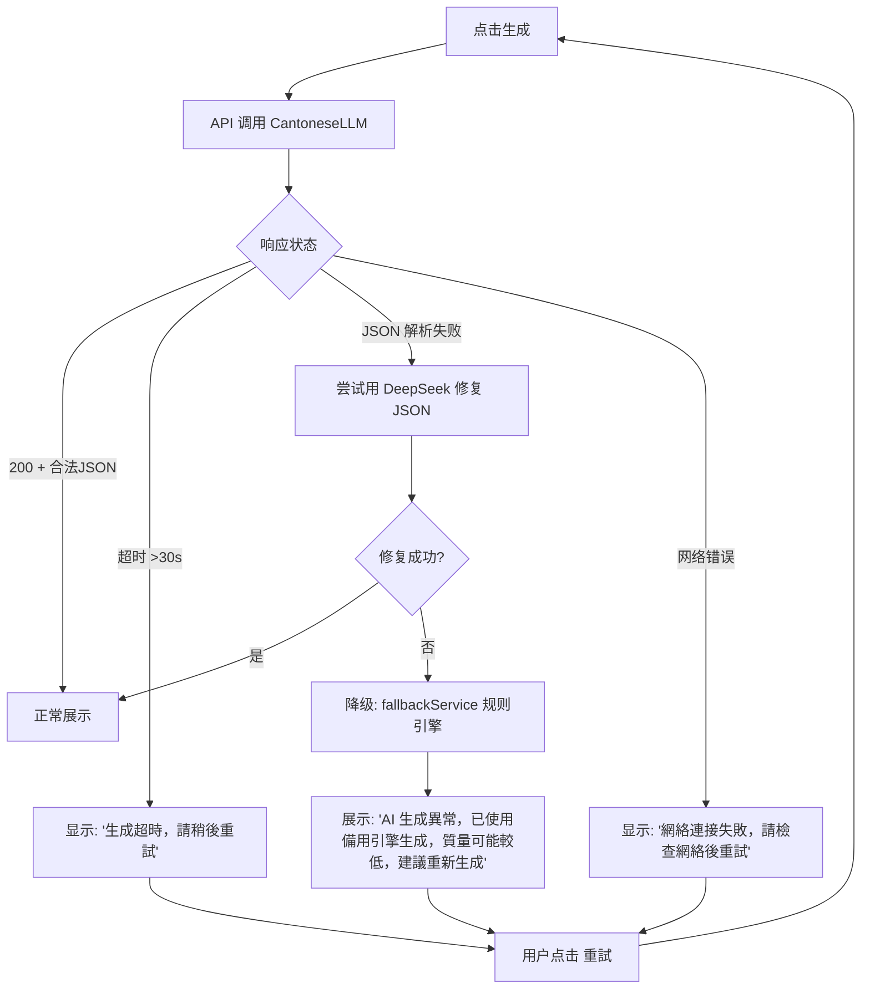
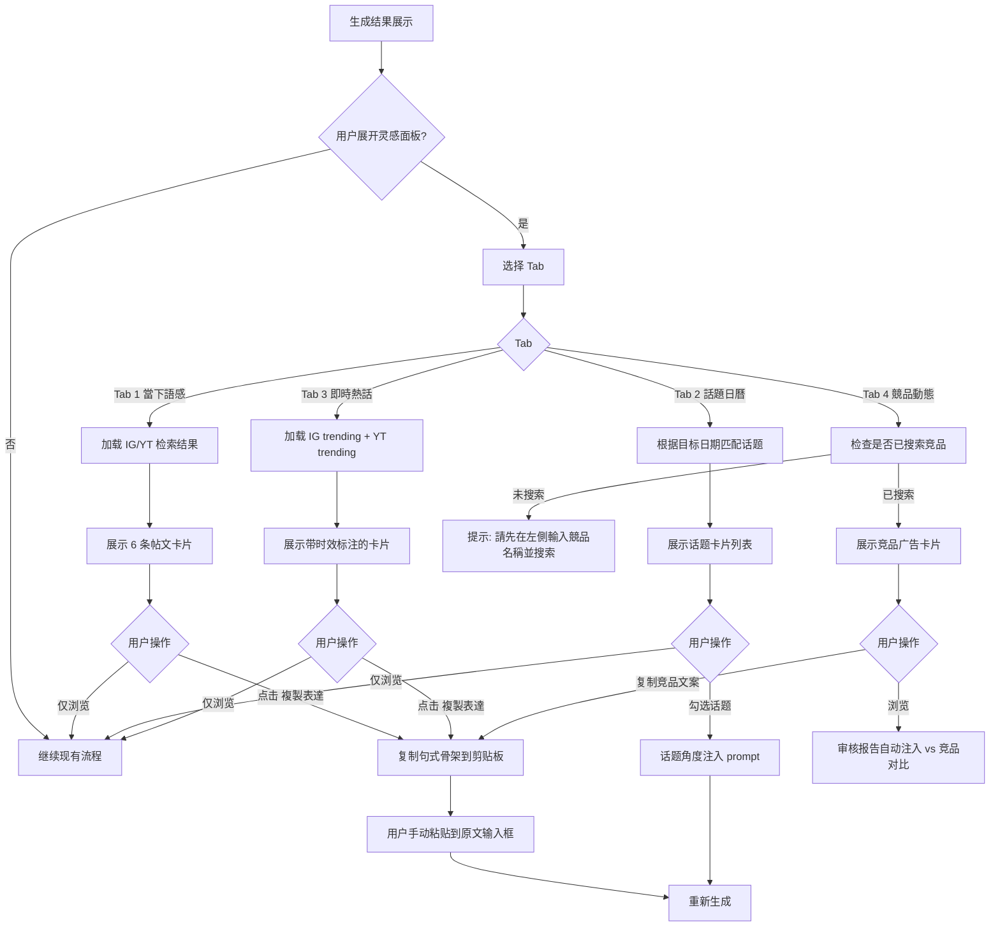

# 77港话社媒文案器 — PRD + SDD 完整规格书

> **文档类型**：产品需求文档（PRD）+ 软件设计文档（SDD）
> **产品名称**：「77港话社媒文案器」
> **版本**：V2.0
> **撰写日期**：2026-06-15
> **状态**：MVP 已上线 + Phase 1 已完成 + Phase 2 已完成，本文檔覆蓋當前全部已實現能力 + Phase 3 待建能力
>
> **V2.0 更新要點**：
> - Phase 1 全部完成：結構化寫作簡報、So What 自適應規則、6-part JTBD Value Prop、備選標題
> - Phase 2 全部完成：靈感面板（4 Tab）、話題日曆、IG/YT 外部檢索、競品廣告搜索、快速規則檢查、目標日期選擇器
> - 模型架構更新：自託管 Cantonese 4B 為主力、DeepSeek 為備用/審核引擎、Featherless 暫停
> - 新增 18 個源文件（9 server + 9 client），修改 8 個現有文件
> - 消費者反饋一鍵修改歷史追蹤（防止重複修改）
>
> **数据来源**：
> - 現有代碼庫（server 27 文件 + client 47 文件）
> - `pm-skills-main`（68 个 PM 技能，14 个嵌入产品）
> - `comprehensive-spec-v2.md`（综合优化路线图）
> - `inspiration-design功能设计策略.md`（灵感面板设计）

---

## 目录

1. [产品概念](#一产品概念)
2. [目标用户与使用场景](#二目标用户与使用场景)
3. [核心用户动线](#三核心用户动线)
4. [关键页面布局](#四关键页面布局)
5. [功能清单](#五功能清单)
6. [功能详细描述](#六功能详细描述)
7. [技术架构（SDD）](#七技术架构sdd)
8. [数据模型（SDD）](#八数据模型sdd)
9. [API 设计（SDD）](#九api-设计sdd)
10. [Prompt 工程架构（SDD）](#十prompt-工程架构sdd)
11. [文案规范](#十一文案规范)
12. [非功能性需求](#十二非功能性需求)
13. [分期实施计划](#十三分期实施计划)
14. [Pre-Mortem 风险分析](#十四pre-mortem-风险分析)
15. [待确认问题](#十五待确认问题)
16. [通用模型港話質量優化策略](#十六通用模型港話質量優化策略)

---

## 一、产品概念

### 1.1 一句话定位

> 这是一个给**需要产出港式社媒文案的营销人、品牌方、内容创作者**用的 **Web App**，帮他们**将品牌信息转化为地道粤语社媒内容，覆盖 5 个平台变体 + 合规审核 + 灵感参考**。
> 与「直接请人写」「用通用 AI 翻译」相比，核心差异是：**AI 原生理解粤语语感 + 内置 11 类 HK 合规规则 + 自动诊断内地腔 + 灵感参考面板**。

### 1.2 产品形态

- **当前选型**：Web App（React SPA + Express 后端 + 第三方 AI API）
- **选择理由**：
  - 目标用户在香港，以桌面办公为主（社媒运营、营销策划），大屏操作效率更高
  - 功能相对复杂（三栏布局、多 Tab、审核面板），Web 有足够的屏幕空间
  - 无需设备能力（摄像头/GPS/推送），不依赖原生
  - 开发最快，跨平台，分享链接即可使用
- **阶段策略**：当前仅 Web 版。后续如用户在移动端有强需求（如「地铁上改文案」），可考虑 PWA 或响应式优化，但不做原生 App

### 1.3 产品目标（North Star）

```
NSM: 每周成功发布到社媒平台的文案数量
     (Weekly Published Posts)
```

| Input Metric | 定义 | 当前状态 |
|-------------|------|---------|
| 一次生成满意率 | 生成后无需修改直接采用的比例 | 未追踪 |
| 审核后修改率 | 审核+反馈后实际修改的比例 | 未追踪 |
| 灵感参考使用率 | 打开灵感面板并点击「複製表達」的比例 | 功能未上线 |
| 竞品检索触发率 | 生成前搜索竞品广告的比例 | 功能未上线 |

### 1.4 竞品格局

| 类型 | 代表 | 我们的差异 |
|------|------|-----------|
| 通用 AI 翻译 | ChatGPT / Claude 直接翻译 | 我们内置粤语语感调参 + 5 平台变体 + 合规审核 |
| 香港本地文案服务 | 自由职业者 / 小型 agency | 我们即时出稿、成本趋零、可批量迭代 |
| 通用社媒工具 | Canva AI / Jasper | 他们不懂粤语，我们只做香港市场 |
| 内地小红书工具 | 零克查词 / 句易网 | 他们做简体中文 + 内地合规，我们做粤语 + HK 法规 |

---

## 二、目标用户与使用场景

### 2.1 核心用户画像

#### 画像 1：品牌社媒运营经理（Amy）

| 属性 | 描述 |
|------|------|
| 年龄 | 28-35 岁 |
| 角色 | 在品牌方负责 FB + IG 日常内容运营 |
| 日常工作 | 每天产出 2-3 条帖文，需要覆盖不同平台 |
| 痛点 | ① 总部给的简体中文素材直接翻译成粤语很奇怪；② 不知道怎么写才不算「广告味太重」；③ 对不同平台的语气差异把握不准 |
| JTBD | 「把总部给的产品素材快速转成 5 个平台版本的港式文案，不用每次都想破头」 |
| 选择我们的原因 | 一键生成 5 个版本 + 审核打分 + 不会写出「爆款来袭」「宝子们」这种内地腔 |

#### 画像 2：中小企业老板 / 一人营销部（Ken）

| 属性 | 描述 |
|------|------|
| 年龄 | 35-50 岁 |
| 角色 | 经营本地零售/餐饮生意，自己管 Facebook 主页 |
| 日常工作 | 每周发 3-5 条帖文，促销/新品/节日祝福 |
| 痛点 | ① 请不起 agency；② 不懂怎么写「港式文案」；③ 怕不小心写了违规内容被罚款 |
| JTBD | 「自己写得出一段粤语文案，不用担心违规，看起来不像广告」 |
| 选择我们的原因 | 简单输入 → 直接出稿 → 合规自动检查 |

### 2.2 典型使用场景

**场景 1：从总部素材到多平台发布（Amy）**

> Amy 收到总部发来的一段简体中文产品介绍：「我们的月饼采用湖南湘潭莲子，搭配意大利进口橄榄油，口感细腻，香气浓郁。」她打开 77港话，粘贴原文 → 调参数（语气：活潑，粤语程度：3/5，平台：全部）→ 点生成。10 秒后获得 5 个版本：standardHK 适合官网、lightCantonese 适合 CRM、IG 版有 emoji + hashtag、FB 版有详细背景、Shorts 版有强 hook。她看了审核评分（品牌安全 85、港味 78），直接复制 IG 版发布。

**场景 2：节日借势快速出稿（Ken）**

> 父亲节前三天，Ken 想发一条帖文。他输入「父亲节快乐，感谢爸爸」，打开灵感面板 Tab 2「話題日曆」→ 勾选「父親節」话题 → 开启「📋 結構化寫作簡報」→ 点生成。AI 生成了一条融合「父亲节感谢 + 产品自然植入」的帖文，附带 3 个备选标题。Ken 选了最顺眼的，直接复制发布。

**场景 3：竞品监测 + 差异化迭代（Amy）**

> Amy 想看看竞品「美心月餅」最近在投什么广告。她在竞品搜索框输入「美心月餅」→ 灵感面板 Tab 4 加载 10 条活跃广告 → 她看到竞品都在用「傳統手工」「用心製作」→ 重新生成时，系统在审核报告中标注了「与竞品 A 相似度 62%」→ 她据此调整了差异化角度。

---

## 三、核心用户动线

### 3.1 主流程：生成港式文案



### 3.2 异常分支：生成失败



### 3.3 灵感参考辅助流程



---

## 四、关键页面布局

### 4.1 当前布局（MVP 已上线）

```
┌──────────────┬───────────────────────┬──────────────┐
│  LEFT (30%)  │    CENTER (flex)      │  RIGHT (30%) │
│              │                       │              │
│ [Header: Logo + ThemeToggle]         │              │
├──────────────┤                       │              │
│ SourceEditor │  [VariantTabs]        │  AuditPanel  │
│ (textarea)   │  ┌─────────────────┐  │  · 港味      │
│              │  │ ResultCard ×5   │  │  · 品牌安全  │
│ LanguageToggle│ │ · 正文          │  │  · 平台适配  │
│              │  │ · 复制/编辑     │  │  · 可读性    │
│ BrandInput   │  └─────────────────┘  │  · 创意      │
│ BrandRedLines│                       │              │
│ Creativity   │  DiagnosisSummary     │  Consumer    │
│ Platform     │  · mainland phrases   │  Feedback    │
│ Tone         │  · issues            │  · persona   │
│ CantoSlider  │  · compliance        │  · suggestions│
│ EnglishSlider│                       │              │
│ PersonaMgr   │                       │              │
│ ConfigMgr    │                       │              │
│ [🚀 生成]    │                       │              │
│              │                       │              │
├──────────────┴───────────────────────┴──────────────┤
│ [Footer: 状态信息]                                    │
└──────────────────────────────────────────────────────┘
```

### 4.2 Phase 2 完整布局（含灵感面板）

```
┌──────────────┬───────────────────────────┬──────────────┐
│  LEFT (30%)  │       CENTER (flex)       │  RIGHT (30%) │
│              │                           │              │
│ SourceEditor │  [VariantTabs]            │  AuditPanel  │
│ LanguageToggle│ ┌───────────────────────┐ │              │
│ BrandInput   │ │ **標題**              │ │  港味 ██░   │
│ BrandRedLines│ │ 文案正文...           │ │  品牌安全    │
│              │ │                       │ │  平台适配    │
│ 📅 目標發布  │ │ 📋 備選標題           │ │  可读性     │
│     時間     │ │ 💡 價值主張(toggle ON)│ │  创意       │
│              │ └───────────────────────┘ │              │
│ 🔍 競品搜索  │  DiagnosisSummary         │  CTA 评分    │
│              │                           │  ███░ 75    │
│ Creativity   │ ┌─ 💡 靈感參考 ──────────┐│              │
│              │ │ Tab1│Tab2│Tab3│Tab4    ││  vs 競品     │
│ 📋 結構化    │ │                       ││  ┌──────┐   │
│   寫作簡報   │ │ 帖文卡片 / 话题卡片 /   ││  │Us vs │   │
│  [🔘 ON/OFF]│ │ 竞品广告卡片           ││  │Them  │   │
│              │ │                       ││  └──────┘   │
│ Platform     │ │ [複製表達] [複製全文]   ││              │
│ Tone         │ └───────────────────────┘│  Consumer    │
│ CantoSlider  │                           │  Feedback    │
│ EnglishSlider│                           │              │
│ PersonaMgr   │                           │              │
│ ConfigMgr    │                           │              │
│ [🚀 生成]    │                           │              │
└──────────────┴───────────────────────────┴──────────────┘
```

**布局决策说明**：
- 灵感面板放在 Center 下方而非 Left Sidebar：Center 更宽（帖文卡片可完整展示），认知流更自然（看结果 → 找灵感 → 迭代）
- 面板默认折叠，生成后自动展开
- 结构化写作简报 toggle 紧邻创作自由度：两者共同决定「AI 是保守翻译还是策略创作」

---

## 五、功能清单

```
77港话社媒文案器
│
├── 🔴 模块 A：文案生成（核心，MVP 已上线）
│   ├── A1 原文诊断（简繁检测、内地腔替换、粤语AI腔检测、合规红线检测）
│   ├── A2 五版本生成（standardHK / lightCantonese / IG / Facebook / Shorts）
│   ├── A3 粤语程度控制（0-5 档滑块）
│   ├── A4 中英夹杂控制（0-5 档滑块）
│   ├── A5 品牌语气选择（穩妥 / 活潑 / 高級 / 街坊 / 年輕）
│   ├── A6 创作自由度控制（0-4 档：紧贴原文 → 自由创作）
│   ├── A7 输入语言检测（普通话 vs 粤语 → 翻译 vs 优化）
│   ├── A8 品牌/产品名识别（仅作上下文，不强制输出）
│   ├── A9 品牌表达红线约束 ✅（用户自定义 + 内置 11 类 HK 合规规则）
│   └── A10 平台目标筛选（all / ig / facebook / shorts）
│
├── 🔴 模块 B：审核评分（核心，MVP 已上线）
│   ├── B1 五维加权评分（港味 30% + 品牌安全 20% + 平台适配 20% + 可读性 15% + 创意 15%）
│   ├── B2 修改前后 diff 高亮（prefix-suffix 字符级算法）
│   ├── B3 消费者角色模拟反馈（多 persona 评审 + 修改建议）
│   ├── B4 修改建议应用（apply-suggestion → 重新审核）
│   └── B5 评分递增规则引擎（小幅 ±5、中等 ±10、未改动维度 ±3）
│
├── ✅ 模块 C：Prompt 增强（Phase 1，已完成）
│   ├── C1 📋 结构化写作简报 toggle（P1.0）✅
│   ├── C2 Benefit-over-Feature So What 自适应规则（P1.1）✅
│   ├── C3 Writing Brief 结构化注入（P1.2，仅 toggle=ON）✅
│   ├── C4 6-part JTBD Value Prop 注入（P1.2a，仅 toggle=ON）✅
│   └── C5 备选标题 + Value Prop Statement（P1.4）✅
│
├── ✅ 模块 D：灵感参考面板（Phase 2，已完成）
│   ├── D1 面板容器（可折叠 + 4 Tab 切换）✅
│   ├── D2 Tab「當下語感」— IG/YT 热门帖文 few-shot 参考 ✅
│   ├── D3 Tab「話題日曆」— 目标日期匹配可借势话题 ✅
│   ├── D4 Tab「即時熱話」— 实时 trending 帖文（不自动注入）✅
│   ├── D5 Tab「競品動態」— Meta Ad Library 竞品广告 ✅
│   ├── D6 「複製表達」按钮（复制句式骨架，去话题化）✅
│   └── D7 📅 目标发布时间字段（日期选择器）✅
│
├── ✅ 模块 E：审核增强（Phase 2，已完成）
│   ├── E1 审核维度扩展（+语气一致度、利益转化度、情感共鸣度）✅
│   ├── E2 CTA 独立评分（0-100 分 + 扣分原因）✅
│   ├── E3 快速规则检查（纯本地正则引擎 6 项检测）✅
│   ├── E4 内容刷新模式（🆕 全新生成 / 🔄 刷新舊文）✅
│   └── E5 审核「vs 竞品」对比维度（依赖竞品检索）✅
│
├── ✅ 模块 F：外部数据检索（Phase 2，已完成）
│   ├── F1 Meta Ad Library 竞品广告检索（Python 脚本 + Meta Graph API）✅
│   ├── F2 IG Hashtag 热门帖文检索（HTTP GET + JSON 解析）✅
│   └── F3 YouTube HK 热门内容检索（YT Data API v3，需 YOUTUBE_API_KEY）✅
│
├── ⚪ 模块 G：高级分析（Phase 3，远期）
│   ├── G1 参考语料库 + RAG 检索（半自动化采集 + 人工标注）
│   ├── G2 专家小组评分（persona × lens matrix）
│   ├── G3 发布策略建议（最佳时间 + hashtag + 增长循环类型）
│   ├── G4 行业 CTA 基准（≥200 条数据后聚合统计）
│   └── G5 A/B 变体实验建议
│
└── 🔴 模块 H：基础设施（已上线，持续维护）
    ├── H1 深色/浅色主题切换（Tailwind CSS v4 light: 变体）
    ├── H2 保存/加载配置（localStorage + 预设管理，最多 20 个）
    ├── H3 自託管 Cantonese 4B 主引擎（hon9kon9ize/Qwen3-4B-CV-KD）
    ├── H4 DeepSeek 備用/審核引擎（deepseek-chat）
    ├── H5 fallback 规则引擎（正则替换 + 模板拼接）
    └── H6 错误处理 + 加载状态 + 空状态
```

---

## 六、功能详细描述

### 6.1 模块 A：文案生成

#### A1 原文诊断

**功能描述**：在生成文案前，先分析用户输入的原文，标出简繁混用、内地营销词汇、AI 腔、合规红线等问题，帮助用户理解「哪些地方需要改」。

**触发条件**：用户点击「🚀 生成」按钮。

**交互细节**：

| 场景 | 交互处理方式 |
|------|------------|
| 操作反馈 | 生成按钮变为 spinning + 「生成中...」；诊断和生成同时进行，先展示诊断结果，再展示生成结果 |
| 危险操作确认 | 无需确认 |
| 空状态引导 | 原文为空时，按钮 disabled + tooltip「請先輸入原文」 |
| 操作失败引导 | 诊断失败不阻塞生成——显示 warning「診斷異常，已跳過」并继续生成 |

**状态清单**：

| 状态 | 触发条件 | UI 表现 | 用户可执行操作 |
|------|---------|---------|-------------|
| 默认 | 页面首次加载 | 空 textarea + placeholder「請輸入需要轉換的內地文案...」 | 输入原文 |
| 就绪 | 原文已输入 | 按钮变为 active 状态 | 点击生成 |
| 加载中 | 点击生成后 | 按钮 spinning + 「生成中...」 | 不可重复点击 |
| 成功 | 生成完成 | DiagnosisSummary 展示诊断项 + 5 个 variant tab | 查看/复制/编辑 |
| 部分失败 | 诊断异常但生成成功 | DiagnosisSummary 显示「⚠️ 診斷異常，已跳過」 | 查看/复制/编辑 |
| 完全失败 | API 超时或 JSON 解析失败 | 降级为 fallback 引擎 + toast 提示 | 重试 |

**边界条件**：

- 内容为空时：按钮 disabled，显示 tooltip
- 内容超长时：字数上限 2000 字；超出时 textarea 边框变红 + 提示「原文超過 2000 字上限，請精簡後再試」
- 网络异常时：显示 toast「網絡連接失敗，請檢查網絡後重試」+ 重试按钮
- 无权限时：不适用（无登录）
- 并发操作时：按钮 loading 期间 disabled 防止重复提交
- 数据格式不符时：非文本输入不在范围内

---

#### A6 创作自由度控制

**功能描述**：5 档滑块（0-4），控制 AI 生成文案的「自由程度」——从严格翻译（L0）到完全创作（L4）。

**触发条件**：用户滑动滑块。

**交互细节**：

| 场景 | 交互处理方式 |
|------|------------|
| 操作反馈 | 滑块实时显示当前档位 + 档位描述文字（如「緊貼原文 — 語言轉換模式」） |
| 档位切换 | 档位切换时无延迟，仅改变后续生成时的 prompt |
| 空状态 | 默认值为 2（平衡模式） |

**各档位行为规范**：

| 档位 | 名称 | AI 行为 | 字数浮动 | 适用场景 |
|------|------|---------|---------|---------|
| 0 | 緊貼原文 | 纯语言转换，不添加原文没有的任何信息 | ±15% | 合规敏感文案、已有精修原文 |
| 1 | 偏向保守 | 轻度润色，可微调配词 | ±25% | 原文质量较高、只需本地化 |
| 2 | 平衡（默认）| 本地化改写，保留核心信息 | ±50% | 大多数场景 |
| 3 | 偏向自由 | 重结构、加 hook、加互动引导、加 emoji/hashtag | 1.5-3× | 需要高质量社媒创作 |
| 4 | 自由創作 | 可改变文案形态（诗歌/笑话/故事/对话/清单/测验/直球广告/软广告），切换人称呼视角，各自设定策略目的 | 无限制 | 品牌创意 campaign |

---

#### 📋 结构化写作简报 toggle（P1.0，已完成）

**功能描述**：紧邻创作自由度下方的开关。控制是否注入完整的 6-part JTBD Value Prop 结构化写作框架。

**触发条件**：用户点击 toggle。

**交互细节**：

| 场景 | 交互处理方式 |
|------|------------|
| 操作反馈 | toggle 实时切换，无延迟 |
| 默认状态 | OFF |
| OFF 行为 | 仅注入品牌/产品识别信息（现有 buildBrandSection）；So What 规则自适应触发 |
| ON 行为 | 完整注入 Writing Brief + 6-part JTBD + Value Prop Statement |
| 智能提示 | 当系统检测到原文包含产品描述（品牌名、成分、功效等）且 toggle=OFF 时，在 toggle 下方显示轻提示「💡 呢條文案包含產品資訊，開啟結構化寫作簡報可能會提升生成質量」 |

**实现位置**：
- `client/src/components/input/StructuredBriefToggle.tsx` — UI 组件
- `server/src/prompts/diagnoseGenerate.ts` — `buildWritingBrief()` + `buildJTBDValueProp()`

**边界条件**：

- Toggle ON 但原文是纯节日祝福：AI 应忽略不适用的 6-part 框架题目（如 Alternatives/How），只填充有意义的字段
- Toggle OFF 但原文是详细产品介绍：系统给出轻提示，但不强制用户开启

---

### 6.2 模块 D：灵感参考面板（Phase 2，已完成）

#### D1 面板容器

**功能描述**：Center Panel 下方的可折叠面板，包含 4 个 Tab。

**触发条件**：用户点击标题栏「💡 靈感參考」展开/折叠。

**交互细节**：

| 场景 | 交互处理方式 |
|------|------------|
| 默认状态 | 折叠（仅显示标题栏） |
| 生成后 | 自动展开 |
| 折叠 | 点击标题栏任意位置 toggle；平滑动画 |
| Tab 切换 | 点击 Tab 标签切换，保持面板展开状态 |

**状态清单**：

| 状态 | 触发条件 | UI 表现 |
|------|---------|---------|
| 折叠 | 默认 / 用户手动折叠 | 仅显示「💡 靈感參考（展開）」标题栏 |
| 展开-加载中 | 展开时触发数据检索 | Tab 内容区显示 Skeleton 卡片 |
| 展开-有数据 | 检索完成 | 显示卡片列表 |
| 展开-空数据 | 检索无结果 | 「暫無相關數據」+ 引导文字 |
| 展开-错误 | 检索失败 | 「數據加載失敗」+ 重试按钮 |

---

#### D5 Tab「競品動態」

**功能描述**：展示竞品在 Meta Ad Library 上的活跃广告。

**触发条件**：用户在 Left Sidebar 竞品搜索框输入品牌名并点击搜索。

**交互细节**：

| 场景 | 交互处理方式 |
|------|------------|
| 未搜索时 | Tab 内容区显示「請先在左側輸入競品名稱並搜索」+ 输入引导 |
| 搜索中 | 搜索按钮 spinning + 「搜索中...」 |
| 搜索完成 | 展示最多 10 条竞品广告卡片 |
| 点击卡片 | 「查看完整廣告」→ 新标签打开 Meta Ad Library 页面 |
| 复制竞品文案 | 「📋 複製文案」→ 复制到剪贴板 + toast「已複製」 |

**竞品广告卡片数据规范**：

| 字段 | 来源 | 说明 |
|------|------|------|
| adArchiveId | Meta Ad Library | 唯一标识 |
| pageName | Meta Ad Library | 广告主页面名称 |
| platform | Meta Ad Library | 投放平台（facebook/instagram 等） |
| body | Meta Ad Library | 广告正文 |
| title | Meta Ad Library | 广告标题 |
| ctaText | Meta Ad Library | CTA 文案 |
| isActive | Meta Ad Library | 是否仍在投放 |
| startDate | Meta Ad Library | 开始投放时间戳 |

---

### 6.3 模块 E：审核增强（Phase 2，已完成）

#### E3 快速规则检查

**功能描述**：纯本地正则引擎，不调用 AI，对文案做 6 项快速检查。

**6 项检查规则**：

| # | 检查项 | 正则/规则 | 示例 |
|---|--------|----------|------|
| 1 | 过长句子 | 中文字数 > 30 | 「呢個產品採用咗進口原材料經過多重工序精心製作而成品質有保證」→ 拆分为 2 句 |
| 2 | 被动语态 | `被\|遭受\|受到\|遭到` | 「產品被設計為...」→「產品設計係...」 |
| 3 | 模糊词 | `優化\|提升\|改善\|加強\|增強\|完善` | 「全面提升品質」→ 具体化 |
| 4 | 弱化词 | `好\|非常\|相當\|十分\|極度\|超級` | 「非常好食」→「好食」或更具体的描述 |
| 5 | 缺数字的声明 | 含百分比/倍数/排名但无具体数字 | 「銷量激增」→ 建议补充具体数据 |
| 6 | 结构不完整 | 无 CTA 或无互动引导 | 检测是否以句号结尾且无问句/引导 |

**状态清单**：

| 状态 | UI 表现 |
|------|---------|
| 全部通过 | 绿色 ✅「6 項檢查全部通過」 |
| 有 warning | 黄色 ⚠️「N 項建議優化」+ inline 高亮标注 |
| 有 error | 红色 🚫「N 項需要修改」+ inline 高亮标注 |

---

## 七、技术架构（SDD）

### 7.1 架构全景图

```
┌─────────────────────────────────────────────────────────────┐
│                     Client (React 19 + Tailwind CSS v4)      │
│                                                             │
│  AppContext (useReducer) → settings / variants / audit       │
│       │                                                     │
│  ┌────┴──────────┬──────────────┬──────────────┬──────────┐ │
│  │ InputPanel    │ ResultsPanel │ AuditPanel   │Inspir.   │ │
│  │               │              │              │Panel     │ │
│  │ SourceEditor  │ VariantTabs  │ ScoreDisplay │ 4 Tabs   │ │
│  │ BrandInput    │ ResultCard   │ Thermometer  │ PostCard │ │
│  │ RedLinesInput │ Diagnosis    │ IssueChips   │ Calendar │ │
│  │ Creativity    │ CopyButton   │ ConsumerFb   │ CompAd   │ │
│  │ PlatformSel   │ QuickCheck   │ RiskNotes    │          │ │
│  │ ToneSelector  │              │              │          │ │
│  │ CantoSlider   │              │              │          │ │
│  │ EnglishSlider │              │              │          │ │
│  │ PersonaMgr    │              │              │          │ │
│  │ ConfigMgr     │              │              │          │ │
│  │ BriefToggle   │              │              │          │ │
│  │ TargetDate    │              │              │          │ │
│  │ CompSearch    │              │              │          │ │
│  └───────────────┴──────────────┴──────────────┴──────────┘ │
└──────────────────────┬──────────────────────────────────────┘
                       │ REST API (fetch)
┌──────────────────────┴──────────────────────────────────────┐
│                     Server (Express + TypeScript)            │
│                                                             │
│  Routes            Prompts             Services             │
│  ├─ /api/generate  ├─ diagnoseGenerate  ├─ deepseekService  │
│  ├─ /api/audit     ├─ audit            ├─ cantoneseService  │
│  ├─ /api/re-audit  ├─ reAudit          │  ├─ self-hosted    │
│  ├─ /api/modify    ├─ systemPrompt     │  ├─ featherless⚠️  │
│  ├─ /api/parse     ├─ promptBuilder    │  └─ multi-fallback │
│  └─ /api/health    └─ complianceRules  ├─ fallbackService   │
│                                         ├─ personaService   │
│                                         └─ parseJson        │
└──────────────────────┬──────────────────────────────────────┘
                       │
          ┌────────────┼────────────┐
          ▼            ▼            ▼
    ┌──────────┐ ┌──────────┐ ┌──────────────┐
    │DeepSeek  │ │Cantonese │ │ 本地規則引擎  │
    │API       │ │LLM (32B) │ │              │
    │deepseek- │ │⚠️ 暫停   │ │ fallbackSvc  │
    │chat      │ │Featherless│ │ 正則+模板    │
    │✅ 主力    │ │          │ │ ✅ 最後防線  │
    └──────────┘ └──────────┘ └──────────────┘
```

### 7.2 模型职责划分（2026-06-15 更新）

**当前实际运行的多層 Fallback 架構**：

```
用戶點擊生成
    │
    ▼
┌─ Priority 1: 自託管 Cantonese LLM (CANTONESE_API_URL env) ──┐
│  model: hon9kon9ize/Qwen3-4B-CV-KD (或自定義)                 │
│  timeout: 300s (local) / 60s (remote)                        │
│  狀態：✅ 如配置則最優先，當前主力                                │
└──────────────────────────────────────────────────────────────┘
    │ 失敗/未配置
    ▼
┌─ Priority 2: Featherless CantoneseLLMChat-v1.0-32B ─────────┐
│  endpoint: https://api.featherless.ai/v1                     │
│  model: hon9kon9ize/CantoneseLLMChat-v1.0-32B                │
│  狀態：⚠️ upgrade_required（訂閱暫停，自動跳過）                │
│  行為：isFatalError() → 立即跳過，不浪費時間                    │
└──────────────────────────────────────────────────────────────┘
    │ 失敗/未配置
    ▼
┌─ Priority 3: DeepSeek deepseek-chat ────────────────────────┐
│  endpoint: https://api.deepseek.com                          │
│  model: deepseek-chat                                        │
│  timeout: 25s                                                │
│  狀態：✅ 備用生成 + 主力審核 + 消費者反饋 + JSON 修復          │
└──────────────────────────────────────────────────────────────┘
    │ 失敗
    ▼
┌─ Priority 4: fallbackService.ts 本地規則引擎 ────────────────┐
│  正則替換 + 模板拼接 + 基礎診斷                                │
│  狀態：✅ 最後防線                                             │
└──────────────────────────────────────────────────────────────┘
```

| 任务 | 首選模型 | 備選模型 | 備註 |
|------|---------|---------|------|
| 文案生成 | 自託管 Cantonese（如配置） | DeepSeek `deepseek-chat` | Featherless 當前不可用 |
| 審核評分 | DeepSeek `deepseek-chat` | fallbackService 規則引擎 | 結構化 JSON 輸出穩定 |
| 消費者反饋 | DeepSeek `deepseek-chat` | fallback（audit comments 兜底） | 多角色推理 + 修改建議 |
| 原文診斷 | DeepSeek `deepseek-chat` | fallbackService 正則引擎 | 簡繁檢測 + 內地腔替換 |
| Source Scoring | DeepSeek `deepseek-chat` | null（僅 AI 引擎可用） | 前後對比用 |
| JSON 修復 | DeepSeek `deepseek-chat` | parseJSON 容錯 | CantoneseLLM 輸出異常時 |
| Persona 解析 | DeepSeek `deepseek-chat` | — | 自由文本 → 結構化 persona |
| 翻譯（粵→普） | DeepSeek `deepseek-chat` | — | 消費者反饋翻譯 |
| 建議應用 | DeepSeek `deepseek-chat` | — | 消費者建議一鍵修改 |
| 語料庫匹配 | 本地關鍵詞 + 正則 | — | 確定性匹配，零延遲 |
| 快速規則檢查 | 本地正則引擎 | — | 零延遲，離線可用 |
| Fallback 生成 | 本地 `fallbackService.ts` | — | AI 全部不可用時的最後防線 |

**Featherless 狀態說明**：API Key 存在但返回 `upgrade_required`（免費用戶無推理權限）。代碼已實現 `isFatalError()` 偵測，遇到此錯誤立即跳過不浪費時間。**當前決策：暫不升級，以自託管 Cantonese 4B + DeepSeek 為主力方案。**

### 7.3 前端技术栈

| 层 | 技术选型 | 原因 |
|----|---------|------|
| 框架 | React 19 + TypeScript 5.7 | 最新稳定版，Server Components 預留 |
| 构建 | Vite 6 | 快速 HMR，TypeScript 原生支持 |
| 样式 | Tailwind CSS v4 (`light:` 变体) | 深色/浅色主题，utility-first |
| 图标 | Lucide React 0.468 | 輕量，tree-shakeable |
| 状态管理 | React Context + useReducer（25 actions） | 单页应用，状态量适中 |
| 持久化 | localStorage（3 个 key） | 配置/预设/主题管理，无需后端 |
| HTTP | fetch API | 无需额外依赖 |

### 7.4 后端技术栈

| 层 | 技术选型 | 原因 |
|----|---------|------|
| 运行时 | Node.js + TypeScript 5.7 | 已有代码库 |
| 框架 | Express 5 | 轻量，路由清晰 |
| AI SDK | OpenAI SDK v4.77 | 统一 API 调用接口 |
| AI 调用 | fetch → 自託管 Cantonese / DeepSeek / Featherless | 多層 fallback |
| 竞品检索 | Python 脚本 (search-ads.py) + Meta Graph API | 雙策略 fallback |
| IG 检索 | HTTP GET + JSON 解析（`__INITIAL_STATE__`） | 无需 API Key |
| YT 检索 | YouTube Data API v3 | 官方 API，需 YOUTUBE_API_KEY |
| 部署 | Netlify (serverless-http) + Cloudflare Tunnel | 雙部署選項 |

---

## 八、数据模型（SDD）

### 8.1 核心类型定义

```ts
// ==================== 枚举 ====================

type InputLanguage = 'mandarin' | 'cantonese';
type BrandTone = '穩妥' | '活潑' | '高級' | '街坊' | '年輕';
type Platform = 'all' | 'ig' | 'facebook' | 'shorts';
type VariantKey = 'standardHK' | 'lightCantonese' | 'ig' | 'facebook' | 'shorts';

// ==================== 用户输入 ====================

interface AppSettings {
  brandName: string;
  productName: string;
  brandRedLines: string;
  targetDate?: string;              // 🆕 ISO date string
  competitorQuery?: string;         // 🆕 竞品搜索词
  structuredBriefEnabled: boolean;  // 🆕 默认 false
  tone: BrandTone;
  creativityLevel: number;          // 0-4
  cantoneseLevel: number;           // 0-5
  englishMixingLevel: number;       // 0-5
  platform: Platform;
  inputLanguage: InputLanguage;
}

// ==================== 生成请求 ====================

interface GenerateRequest {
  source: string;
  platform: Platform;
  tone: BrandTone;
  cantoneseLevel: number;
  englishMixingLevel: number;
  creativityLevel: number;
  inputLanguage: InputLanguage;
  brandName?: string;
  productName?: string;
  brandRedLines?: string;
  structuredBriefEnabled?: boolean;  // 🆕
  competitorAds?: CompetitorAd[];    // 🆕
  inspirationPosts?: HKPost[];       // 🆕
  selectedCalendarEvents?: string[]; // 🆕 用户勾选的话题 ID
}

// ==================== 生成响应 ====================

interface GenerateResponse {
  diagnosis: Diagnosis;
  variants: Record<VariantKey, string>;
  variantMeta?: Record<VariantKey, VariantMeta>;  // 🆕 Phase 1
}

interface Diagnosis {
  hasSimplifiedChars: boolean;
  mainlandPhrases: Array<{ phrase: string; suggestion: string }>;
  issues: string[];
  complianceViolations: Array<{
    rule: string;
    match: string;
    severity: 'high' | 'medium' | 'low';
  }>;
}

// ==================== Variant 元数据（🆕 Phase 1）====================

interface VariantMeta {
  headline: string;
  altHeadlines: string[];
  ctaLine: string;
  valuePropStatement?: string;   // 仅 toggle=ON
  targetPersona?: string;
  creativeForm?: string;         // L4: 直球广告/软广告/故事/诗歌/...
  strategyGoal?: string;         // L4: 引流/推广/增长激活/品牌塑造
}

// ==================== 审核 ====================

interface AuditRequest {
  variants: Record<VariantKey, string>;
  originalText: string;
  platform: Platform;
  competitorAds?: CompetitorAd[];  // 🆕
}

interface AuditResponse {
  scores: Record<VariantKey, AuditScores>;
  overallVerdict: string;
  consumerFeedback?: ConsumerFeedbackResult;
}

interface AuditScores {
  cantoneseAuthenticity: number;
  brandSafety: number;
  platformFit: number;
  readability: number;
  creativity: number;
  // 🆕 Phase 2
  voiceConsistency?: number;
  benefitConversion?: number;
  emotionalResonance?: number;
  ctaStrength?: number;
  competitorDifferentiation?: number;
}

// ==================== 竞品数据（🆕 Phase 2）====================

interface CompetitorAd {
  adArchiveId: string;
  pageName: string;
  pageId?: string;
  platform: ('facebook' | 'instagram' | 'messenger' | 'audience_network')[];
  body: string;
  title?: string;
  ctaText?: string;
  linkUrl?: string;
  isActive: boolean;
  startDate: number;
  endDate?: number;
}

// ==================== HK 帖文数据（🆕 Phase 2）====================

interface HKPost {
  id: string;
  platform: 'ig' | 'facebook' | 'youtube';
  type: 'organic' | 'ad';
  industry?: string;
  headline?: string;
  body: string;
  hashtags: string[];
  engagement: {
    likes: number;
    comments: number;
    shares?: number;
    views?: number;
  };
  url: string;
  authorName?: string;
  fetchedAt: string;
  publishedAt?: string;
  expressionFingerprint?: string; // 句式骨架（去话题化）
}

// ==================== 话题日历（🆕 Phase 3）====================

interface CalendarEvent {
  id: string;
  date: string;
  title: string;
  titleZh: string;
  applicableIndustries: string[];
  angles: string[];
  narrativeHooks: string[];
  sensitivityNote?: string;
}

// ==================== 专家评分（🆕 Phase 3）====================

interface ExpertScore {
  personaId: string;
  personaName: string;
  lens: 'clarity' | 'voice' | 'sowhat' | 'proof' | 'specificity' | 'emotion' | 'risk';
  score: number;
  critique: string;
  suggestion: string;
}

// ==================== 发布策略（🆕 Phase 3）====================

interface PublishStrategy {
  bestTimes: Array<{ day: string; hour: number; score: number; rationale: string }>;
  recommendedPlatforms: Array<{ platform: string; priority: number; reason: string }>;
  hashtags: string[];
  commentBait: string;
  frequency: string;
  growthLoopType?: 'viral' | 'usage' | 'collaboration' | 'userGenerated' | 'referral';
  abTestSuggestions?: Array<{
    variable: string;
    variantA: string;
    variantB: string;
    metric: string;
  }>;
}
```

### 8.2 状态管理（AppContext reducer actions）

```ts
type AppAction =
  | { type: 'SET_SOURCE'; payload: string }
  | { type: 'SET_TONE'; payload: BrandTone }
  | { type: 'SET_CANTONESE_LEVEL'; payload: number }
  | { type: 'SET_ENGLISH_MIXING_LEVEL'; payload: number }
  | { type: 'SET_CREATIVITY_LEVEL'; payload: number }
  | { type: 'SET_PLATFORM'; payload: Platform }
  | { type: 'SET_INPUT_LANGUAGE'; payload: InputLanguage }
  | { type: 'SET_BRAND_NAME'; payload: string }
  | { type: 'SET_PRODUCT_NAME'; payload: string }
  | { type: 'SET_BRAND_RED_LINES'; payload: string }
  | { type: 'SET_STRUCTURED_BRIEF_ENABLED'; payload: boolean }    // 🆕
  | { type: 'SET_TARGET_DATE'; payload: string }                  // 🆕
  | { type: 'SET_COMPETITOR_QUERY'; payload: string }             // 🆕
  | { type: 'SET_GENERATION_RESULT'; payload: GenerateResponse }
  | { type: 'SET_AUDIT_RESULT'; payload: AuditResponse }
  | { type: 'SET_CONSUMER_FEEDBACK'; payload: ConsumerFeedbackResult }
  | { type: 'SET_INSPIRATION_DATA'; payload: InspirationData }    // 🆕
  | { type: 'LOAD_CONFIG'; payload: SavedConfig }
  | { type: 'RESET' };
```

---

## 九、API 设计（SDD）

### 9.1 核心端点（全部已實現）

| 方法 | 路径 | 文件 | 描述 |
|------|------|------|------|
| GET | `/api/health` | `app.ts` | 健康檢查 + 引擎狀態 |
| POST | `/api/generate` | `routes/generate.ts` | 診斷 + 5 版本生成（含並行審核/評分/消費者反饋） |
| POST | `/api/translate` | `routes/modify.ts` | 粵語 → 普通話翻譯 |
| POST | `/api/apply-suggestion` | `routes/modify.ts` | 消費者建議一鍵修改（含歷史追蹤） |
| POST | `/api/re-evaluate` | `routes/modify.ts` | 修改後重新審核評分 |
| POST | `/api/quick-check` | `routes/quickCheck.ts` | 本地規則快速檢查（6 項檢測） |
| POST | `/api/parse-personas` | `routes/parsePersonas.ts` | AI 解析 persona 自由文本 |

### 9.2 靈感 + 外部數據端點（全部已實現）

| 方法 | 路径 | 文件 | 描述 |
|------|------|------|------|
| POST | `/api/inspiration/calendar` | `routes/calendar.ts` | 話題日曆匹配（targetDate ±14 天） |
| POST | `/api/inspiration/language-vibe` | `routes/inspiration.ts` | IG #hkfoodie + #hklifestyle + YT trending |
| POST | `/api/inspiration/hot-trends` | `routes/inspiration.ts` | IG #hktrending + YT trending |
| POST | `/api/inspiration/youtube-search` | `routes/inspiration.ts` | YT 搜索（需 YOUTUBE_API_KEY） |
| POST | `/api/inspiration/youtube-trending` | `routes/inspiration.ts` | YT HK 熱門（需 YOUTUBE_API_KEY） |
| POST | `/api/competitor/search` | `routes/competitor.ts` | 競品廣告檢索（Python 腳本 + Meta Graph API） |

### 9.3 错误响应统一格式

```ts
interface ApiError {
  error: string;           // 人类可读的错误信息
  code: string;            // 机器可读的错误码
  retryable: boolean;      // 是否可重试
  suggestion?: string;     // 给用户的下一步建议
}

// 错误码
// INVALID_INPUT     — 请求参数不合法
// AI_TIMEOUT        — AI API 超时
// AI_PARSE_ERROR    — AI 返回了无法解析的内容
// AI_UNAVAILABLE    — AI API 不可用
// RATE_LIMITED       — 外部数据源限速
// EXTERNAL_ERROR    — 外部数据源异常
// INTERNAL_ERROR    — 服务器内部错误
```

---

## 十、Prompt 工程架构（SDD）

### 10.1 分层 Prompt 结构

```
┌─────────────────────────────────────┐
│ Layer 0: System Identity (~20 lines) │  固定，不随参数变化
│ 「你係一個香港粵語 native speaker」    │
├─────────────────────────────────────┤
│ Layer 1: Compliance & Safety (~80L) │  固定注入
│ buildComplianceSection()            │
│ + buildBrandSection()                │
├─────────────────────────────────────┤
│ Layer 2: Writing Framework (~60L)   │  🆕 按 toggle 分支
│ toggle=OFF: 轻量品牌上下文            │
│ toggle=ON:  + Writing Brief          │
│             + 6-part JTBD Value Prop │
├─────────────────────────────────────┤
│ Layer 3: Contextual (~80L)          │  动态注入
│ - Few-shot examples (灵感面板)        │
│ - 竞品文案参考                        │
│ - 话题日历角度                        │
├─────────────────────────────────────┤
│ Layer 4: Generation Params (~60L)   │  动态注入
│ - Platform / Tone / Cantonese /      │
│   EnglishMixing / Creativity         │
├─────────────────────────────────────┤
│ Layer 5: Output Format (~30L)       │  固定
│ - JSON schema                        │
│ - Escape 规则                        │
└─────────────────────────────────────┘
Estimated total: 2500-3500 tokens
```

### 10.2 Toggle 分支逻辑

```ts
// server/src/prompts/diagnoseGenerate.ts

function buildWritingFramework(params: DiagnoseGenerateParams): string {
  // Layer 0-1: always included
  const sections: string[] = [];

  // Layer 2: conditional
  if (params.structuredBriefEnabled) {
    sections.push(buildWritingBrief(params));       // P1.2
    sections.push(buildJTBDValueProp(params));      // P1.2a
  } else {
    // Adaptive: only inject what's already known
    sections.push(buildBrandSection(params.brandName, params.productName));
    sections.push(buildAdaptiveSoWhatRule(params.source)); // P1.1
  }

  // Layer 3: contextual (inspiration data, competitor ads)
  if (params.inspirationPosts?.length) {
    sections.push(buildFewShotSection(params.inspirationPosts));
  }
  if (params.competitorAds?.length) {
    sections.push(buildCompetitorReference(params.competitorAds));
  }
  if (params.selectedCalendarEvents?.length) {
    sections.push(buildCalendarAngleSection(params.selectedCalendarEvents));
  }

  return sections.filter(Boolean).join('\n');
}
```

### 10.3 灵感数据注入格式

```
## 🗣️ 近期港式社媒表達參考（Few-Shot 風格指引）

以下係近期香港 IG 上高互動帖文嘅表達方式，請參考佢哋嘅：
- 語氣：點樣同讀者傾偈？
- 句式：句子長短、分段節奏
- 互動引導：點樣叫人留言/share？

**唔好直接抄內容——參考嘅係表達方式，唔係話題。**

### 參考帖文 1（IG · #hkfoodie · ❤️ 2.3K · 💬 186）
> 「是但問個港島人，中秋必買嘅餅舖係？留言話我知👇」
表達分析：反問式開頭 + 地區標籤 + 簡單互動引導，節奏輕快
```

---

## 十一、文案规范

### 11.1 产品整体文案风格

**风格基调**：亲切友好 + 简洁直接

- 面向香港用户，使用香港繁体中文
- 品牌语气：贴地但不粗俗，专业但不生硬
- UI 提示文案：简体中文优先（因为用户可能是内地品牌方，需要能看懂操作提示）
- AI 生成的文案：仅输出香港繁体中文

### 11.2 面向终端用户的产品文案

| 场景 | 文案内容 | 风格备注 |
|------|---------|---------|
| 页面标题（Header） | 思念 · 港話社媒文案器 | — |
| SourceEditor placeholder | 請輸入需要轉換的內地文案... | 引导性 |
| 空状态（无生成结果） | 喺左邊輸入原文，然後點擊「🚀 生成」即可獲得五個港式文案版本 | 引导用户做第一步 |
| 生成按钮 | 🚀 生成 | 动词开头 |
| 生成中 | ⏳ 生成中... | 让用户知道系统在工作 |
| 生成成功 | ✅ 生成完成 | 正向反馈 |
| 生成失败 | ❌ 生成失敗，請稍後重試 | 说明原因 + 下一步 |
| 审核加载中 | 🔍 審核中... | — |
| 复制成功 toast | 📋 已複製到剪貼板 | 简洁 |
| 保存配置成功 | 💾 配置已保存 | — |
| 网络错误 | 🌐 網絡連接失敗，請檢查網絡後重試 | 原因 + 操作 |
| 结构化简报 toggle label | 📋 結構化寫作簡報 | 功能名称简洁 |
| 结构化简报 toggle 说明 | 啟用後 AI 會按 6-part Value Prop 結構理解品牌定位，適合有明確產品資訊嘅文案。純創意/互動文案建議關閉。 | 说明适用场景 |
| 智能提示（toggle OFF + 有产品信息） | 💡 呢條文案包含產品資訊，開啟「結構化寫作簡報」可能會提升生成質量 | 非阻塞建议 |
| 竞品搜索 placeholder | 輸入競品 Facebook Page 名稱... | — |
| 竞品搜索按钮 | 🔍 搜索競品廣告 | 动词开头 |
| 目标发布时间 label | 📅 目標發布時間（可選） | — |
| 灵感面板折叠标题 | 💡 靈感參考（展開） | — |
| 灵感面板展开标题 | 💡 靈感參考（收起） | — |
| Tab 1 标签 | 當下語感 | 简洁 |
| Tab 2 标签 | 話題日曆 | 简洁 |
| Tab 3 标签 | 即時熱話 🔴 | 带 LIVE 标记 |
| Tab 4 标签 | 競品動態 | 简洁 |
| 複製表達按钮 | 📋 複製表達 | 动词，区分于复制全文 |
| 複製全文按钮 | 📝 複製全文 | — |
| 快速检查通过 | ✅ 6 項檢查全部通過 | 正向反馈 |
| 快速检查有建议 | ⚠️ N 項建議優化 | 中性提示 |
| 危险操作确认（删除配置） | 確定要刪除「{配置名}」嗎？此操作無法撤銷。 | 清楚说明后果 |

---

## 十二、非功能性需求

### 12.1 性能要求

| 指标 | 目标值 | 当前状态 |
|------|--------|---------|
| 首屏加载时间 | < 2s | ✅ 单页 SPA，符合 |
| 生成接口响应（CantoneseLLM） | < 30s，目标 < 15s | ⚠️ 依赖第三方 API，波动大 |
| 审核接口响应（DeepSeek） | < 10s | ✅ 通常 3-5s |
| 快速检查 | < 100ms | 🆕 本地引擎，预期符合 |
| 灵感数据检索 | < 5s（含外部 API） | 🆕 取决于外部数据源 |

### 12.2 权限控制

- 当前无登录/权限系统，所有功能对所有人开放
- 如后续上线商业化版本，需引入：
  - 免费层：每日生成次数限制
  - 付费层：无限生成 + 灵感面板 + 竞品检索

### 12.3 兼容性

| 维度 | 要求 |
|------|------|
| 浏览器 | Chrome 90+, Firefox 90+, Safari 15+, Edge 90+ |
| 分辨率 | 最小 1280×720，推荐 1920×1080 |
| 设备 | 桌面端（优先）；移动端基础可访问（非优先） |
| OS | Windows 10+, macOS 11+, Linux（主流发行版） |

### 12.4 数据安全

- 用户输入的原文和品牌信息仅用于本次生成，不在服务端持久化
- 用户配置保存在浏览器 localStorage，不上传服务器
- AI API 调用通过服务端代理，不暴露 API Key 到前端
- Meta Ad Library 检索结果仅供研究参考

### 12.5 数据存储

- 前端：localStorage（配置 + 预设），上限受浏览器限制（通常 5-10MB）
- 后端：无持久化存储（当前）；语料库（Phase 3）使用 JSON 文件或 SQLite
- 日志：标准输出，包含请求耗时和错误信息，不记录用户原文

---

## 十三、分期实施计划

### Phase 0：跨市场适配研究 ✅ 已完成

| 编号 | 任务 | 状态 |
|------|------|------|
| P0.1 | HK 社媒标题模式研究 | ✅ |
| P0.2 | HK 平台内容模板适配评估 | ✅ |
| P0.3 | xhs 合规 vs HK 法规差异分析 | ✅ |

### Phase 1：Prompt 增强 ✅ 已完成（2026-06-15）

| 编号 | 任务 | 状态 |
|------|------|------|
| P1.0 | 📋 结构化写作简报 toggle | ✅ |
| P1.1 | So What 自适应规则 | ✅ |
| P1.2 | Writing Brief（toggle=ON） | ✅ |
| P1.2a | 6-part JTBD Value Prop（toggle=ON） | ✅ |
| P1.4 | 备选标题 + Value Prop Statement | ✅ |

### Phase 2：审核 + 检索 + 灵感面板 ✅ 已完成（2026-06-15）

| 编号 | 任务 | 文件 | 状态 |
|------|------|------|------|
| P2.1 | 审核维度扩展（+3 维度） | `audit.ts` + `reAudit.ts` | ✅ |
| P2.2 | CTA 独立评分 | `audit.ts` | ✅ |
| P2.3 | 快速规则检查 | `quickCheckService.ts` + `QuickCheck.tsx` | ✅ |
| P2.5 | 内容刷新模式 | `diagnoseGenerate.ts` + `InputPanel.tsx` | ✅ |
| P2.6 | Meta Ad Library 竞品检索 | `competitorService.ts` | ✅ |
| P2.7 | 竞品文案 Prompt 注入 + 差异化 | `diagnoseGenerate.ts` + `audit.ts` | ✅ |
| P2.8 | IG Hashtag 检索 | `igSearchService.ts` | ✅ |
| P2.9 | YouTube 热门检索 | `youtubeSearchService.ts` | ✅ |
| P2D | 灵感面板 UI（4 Tab + 卡片组件） | 10 个新文件 | ✅ |
| P2C | 目标发布时间选择器 + 竞品搜索框 | 2 个新文件 | ✅ |
| — | 消费者一键修改历史追踪 | `modify.ts` + `ConsumerFeedback.tsx` | ✅ |

### Phase 3：数据积累 + 高级分析（待建，预计 1-2 周）

| 编号 | 任务 | 前置条件 | 状态 |
|------|------|---------|------|
| P3.1 | 参考语料库 + RAG 检索 | P2.6/8/9 已完成 | ⚪ 待建 |
| P3.2 | 专家小组评分（persona × lens matrix） | P3.1 | ⚪ 待建 |
| P3.3 | 发布策略建议（最佳时间 + hashtag + 增长循环） | P3.1 | ⚪ 待建 |
| P3.4 | 行业 CTA 基准（≥200 条数据后聚合） | P3.1 | ⚪ 待建 |
| P3.5 | A/B 变体实验建议 | 无 | ⚪ 待建 |

---

## 十四、Pre-Mortem 风险分析

### Tigers（真实风险 — 已缓解或监控中）

| # | 风险 | 缓解措施 | 状态 |
|---|------|---------|------|
| T1 | Prompt 膨胀导致生成质量下降 | Phase 1 已完成，prompt token 審計待做 | ⚠️ 監控中 |
| T2 | IG JSON 解析被 Meta 修改页面结构 | graceful degradation：失敗返回空數組 | ✅ 已緩解 |
| T3 | 竞品检索触发 Meta 反爬 | 間隔控制 + 合理 UA + 標註「僅供研究參考」 | ✅ 已緩解 |
| T4 | 新增 headline/altHeadlines 增加 JSON 解析失敗率 | DeepSeek 結構化提取兜底 + parseJSON 容錯 | ✅ 已緩解 |
| T5 | YT API Key 未配置導致 Tab 3 無數據 | graceful degradation：返回空數組 + UI 空狀態引導 | ✅ 已緩解 |

### Paper Tigers（被高估的风险 — 已证实）

| # | 风险 | 为什么不那么可怕 | 状态 |
|---|------|----------------|------|
| P1 | 「灵感面板太复杂，用户不会用」 | 默认折叠；核心流程不依赖面板 | ✅ 已证实 |
| P2 | 「用户不理解结构化简报 toggle」 | 默认 OFF 保持现状；智能提示引导开启 | ✅ 已证实 |
| P3 | 「Prompt 分层架构过度工程」 | 本质是 5 个函数调用，可随时内联回去 | ✅ 已证实 |

### Elephants（团队可能回避的问题）

| # | 问题 | 建议 |
|---|------|------|
| E1 | CantoneseLLM 長期可靠性 | **已實施**：自託管 Qwen3-4B-CV-KD 為主力，DeepSeek 為備用，Featherless 待恢復 |
| E2 | 用户真的需要灵感参考面板吗？ | 已完整實現 4 Tab；收集使用數據後迭代 |
| E3 | 爬取 IG/FB 数据是否违反 ToS？ | 咨询法律意见；标注仅供研究参考 |

---

## 十五、待确认问题

- [ ] **商业化路径**：当前为内部工具。是否有对外商业化计划？如果有，是否影响功能优先级（如免费/付费层级）？
- [x] **CantoneseLLM 备选方案**：~~如果 Featherless.ai 服务中断~~ → **已解決**。當前方案：自託管 Qwen3-4B-CV-KD 為主力 + DeepSeek 為備用。詳見 §七.2 和 §十六。
- [x] **YouTube API 配置**：~~是否需要 YT Data API v3 的 API Key？~~ → 代碼已實現 graceful degradation，無 key 時返回空數組。如需真實 YT 數據，需配置 `YOUTUBE_API_KEY=AIza...`（Google Cloud Console → YouTube Data API v3）。
- [ ] **竞品检索 ToS 合规**：Meta Ad Library 的 Python 腳本方式是否符合使用條款？是否需要標註「僅供研究參考」？
- [ ] **用户反馈机制**：是否需要内置「用户对生成结果的满意度评分」来持续优化 prompt？
- [ ] **多语言扩展**：未来是否考虑支持英文原文 → 粤语文案？或粤语 → 英文？
- [ ] **语料库人工标注资源**：Phase 3 的 10% 人工标注由谁完成？是否有预算？
- [x] **Featherless 訂閱決策**：~~是否升級至 Premium（$25/mo）？~~ → **已決定**：暫不升級，以自託管 + DeepSeek 為主力方案。

---

## 十六、通用模型港話質量優化策略

> **背景**：2026-06-15 起，專業 Cantonese 模型（Featherless）因訂閱問題暫不可用。DeepSeek `deepseek-chat`（映射 deepseek-v4-flash）已接手主力生成。DeepSeek 的粵語能力不弱，但「穩定性」不如專業模型。以下策略旨在用 Prompt 架構彌補模型不確定性。

### 16.1 已實施的質量保障措施

| 措施 | 說明 | 狀態 |
|------|------|------|
| 5 層 Prompt 架構 | Layer 0-5：身份 → 合規 → 框架 → 上下文 → 參數 → 格式 | ✅ 已實施 |
| 多層 Fallback 鏈 | 自託管 → Featherless → DeepSeek → 規則引擎 | ✅ 已實施 |
| `isFatalError()` / `isColdStart()` 分類 | 快速識別不可恢復錯誤，不浪費 timeout | ✅ 已實施 |
| 品牌表達紅線（A9） | 用戶自定義禁用表達 + prompt 注入 | ✅ 已實施 |
| 5 檔創作自由度（A6） | 0-4 檔：緊貼原文 → 自由創作 | ✅ 已實施 |
| 消費者 Persona 模擬反饋 | 多角色評審 + 修改建議 | ✅ 已實施 |

### 16.2 短期優化（零成本，立即見效）

#### ① Few-shot 注入（🔴 最高優先級）

在 prompt 中塞 2-3 個「好文案 vs 差文案」的對比例子。DeepSeek 對 pattern 敏感，有了對比例子，輸出一致性會大幅提升。

```
❌ 差（內地腔）：各位親愛的顧客，我們的產品質量非常優秀，歡迎選購！
✅ 好（港式）：講真，呢個真係幾好用㗎。想試嘅話 link in bio~

❌ 差（太書面）：本產品採用優質原料精心製作而成
✅ 好（港式）：用料靚，手工做，唔係間間有㗎
```

**實施位置**：`server/src/prompts/diagnoseGenerate.ts` 的 `buildFewShotSection()`

#### ② 輸出自檢（Self-critique）

在 prompt 末尾加一段自檢指令，等於用一次 inference 做兩遍質量檢查：

```
生成完之後，請你自己做一次「港話自檢」：
1. 有冇邊度讀起身唔似香港人講嘅？
2. 有冇普通話直譯嘅句式？（例如「幫到你」→ 通常係「啱你」）
3. 語氣詞係咪自然？（㗎、啫、嘛、囉 用啱位未？）
如果自檢發現問題，直接修正後再輸出。
```

**成本**：多 ~200 tokens，可忽略。

#### ③ 港話地雷詞庫

在 system prompt 維護一個「禁用表達」列表——DeepSeek 容易滑回普通話腔的高危詞：

```
以下詞彙/句式係「港話地雷」，生成時嚴格禁止：
- 「親愛的顧客」「尊敬的用戶」
- 「為您帶來」「讓我們一起」
- 「優質」「卓越」「非凡」（太書面）
- 「小夥伴」「寶子」「加载」（內地腔）
```

**實施位置**：`server/src/prompts/systemPrompt.ts` 的 `SYSTEM_PROMPT`

#### ④ 溫度分層策略

| 語氣 | 當前溫度 | 建議溫度 | 原因 |
|------|---------|---------|------|
| 穩妥 | 0.5 | 0.5 | 保持穩定，不需調整 |
| 高級 | 0.6 | 0.55 | 輕微降低，減少「亂發揮」 |
| 活潑 | 0.7 | 0.75 | 輕微提升，增加多樣性 |
| 街坊 | 0.8 | 0.85 | 口語化需要更多隨機性 |
| 年輕 | 0.8 | 0.9 | 最需要創意的檔位 |

**實施位置**：`server/src/types/index.ts` 的 `TONE_TEMPERATURE`

### 16.3 中期優化（需要數據積累）

| 措施 | 說明 | 前置條件 |
|------|------|---------|
| **港話偏好數據集** | 收集審核通過的文案（50-100 條），用 DeepSeek API 微調 | 需要用戶手動標記「滿意」的生成結果 |
| **港話度評分器** | 單獨調一次 DeepSeek 給輸出文案的港話自然度打分（1-5），低於 3 分自動重生成 | 無特殊前置 |
| **擴充 fallbackService 規則庫** | 將 MAINLAND_REPLACEMENTS 從 10 條擴充至 30-50 條 | 收集更多內地→港式對應詞 |

### 16.4 長期方向：恢復專業 Cantonese 模型

| 方案 | 成本 | 延遲 | 質量 | 備註 |
|------|------|------|------|------|
| Featherless Premium | $25/mo | ~3-5s | ⭐⭐⭐⭐⭐ | 最簡單，開箱即用 |
| AutoDL + GGUF Q4_K_M | ~¥1.58/hr（RTX 3090）| ~3-5s | ⭐⭐⭐⭐⭐ | 需部署維護 |
| 本地 RTX 4090 | ~$0.3/hr 電費 | ~2-3s | ⭐⭐⭐⭐⭐ | 一次性硬件投資 |
| 純 DeepSeek + prompt 優化 | $0（現有 API）| ~5-10s | ⭐⭐⭐⭐ | 當前方案，持續迭代 |

---

> **當前狀態（V2.0, 2026-06-15）**：Phase 0/1/2 全部完成，共 27 個 server 文件 + 47 個 client 文件，TypeScript 0 錯誤。Phase 3（語料庫 + RAG + 專家評分 + 發佈策略）為下一階段目標。
>
> **快速啟動**：
> ```bash
> # Server (port 3001)
> cd server && npm run dev
> # Client (port 5173, proxy /api → :3001)
> cd client && npm run dev
> # 自託管 Cantonese 模型（可選，需 Python + GPU）
> python server_4b_api.py
> ```
>
> **環境變量**：見 `.env.example`。核心必需：`DEEPSEEK_API_KEY`。可選：`CANTONESE_API_URL`（自託管）、`YOUTUBE_API_KEY`（YT 數據）、`META_ACCESS_TOKEN`（競品檢索）。
