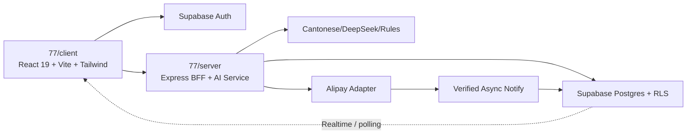

# SDD：77港话通 SaaS MVP

> 2026-07-14 待开发架构增量：文案类型、可选长度控制、主/修饰语气、个人案例库与 Prompt 注入。具体数据与权限边界见 spec/WORKBENCH_CONTENT_CONTROLS.md；未实施。

完整目标设计见 `..\..\开发日志\03-SPEC-77港话通社媒文案器-SaaS.md`。本文件是 Claude Code 的当前实现入口。

## 架构结论



- 唯一代码基线：`77`。
- `总览`：只复用登录页视觉、Supabase/RLS/审计模式；不复用报销领域表和路由。
- 浏览器不可信：不能决定角色、任务归属、金额、额度或支付成功。
- Express BFF：校验 Supabase JWT、权限、额度、输入、幂等键和对象归属。
- 支付成功：只由验签后的异步通知写入业务数据库。

## 托管与跨域（2026-07-14 本地 readiness）

- **部署基线（未执行）：** 两项目 Vercel Hobby — 前端 Root=`client`，API Root=`server`，API region `hnd1`，`maxDuration` 300。详见 `docs/release/2026-07-14-hosting-platform-decision.md` 与 `docs/release/2026-07-14-vercel-two-project-setup.md`。
- **前端 API origin：** `client/src/services/apiBase.ts` 的 `apiUrl()`；未设 `VITE_API_BASE_URL` 时保持相对路径 `/api/...`；禁止任何 secret 进入 `VITE_*`。
- **CORS：** `ALLOWED_ORIGINS` 逗号分隔、严格 exact Origin；空值时仅本地 `http://localhost:5173` 与 `http://127.0.0.1:5173`；无 Origin 请求（Alipay notify / S2S）允许；不默认放行 `*.vercel.app`。
- **支付回调分域：** `ALIPAY_RETURN_URL` / `ALIPAY_NOTIFY_URL` 优先；否则 `APP_FRONTEND_URL`→`/billing/success`，`APP_API_URL`→`/api/billing/alipay/notify`；`APP_PUBLIC_URL` 兼容双用；mock 本地 5173/3001；sandbox 缺配置 fail closed。同步回跳仍不授予 Pro。

## 路由与页面

### 公开

`/`、`/pricing`、`/login`、`/signup`、`/forgot-password`、`/reset-password`、`/auth/callback`、`/billing/success`、`/billing/cancel`

### 用户

`/app`、`/app/generate`、`/app/history`、`/app/history/:id`、`/app/favorites`、`/app/settings/profile`、`/app/settings/brand`、`/app/billing`

### 管理员

`/admin`、`/admin/users`、`/admin/generations`、`/admin/subscriptions`、`/admin/model-ops`、`/admin/settings`、`/admin/audit`、`/admin/admins`

## 前端设计系统与复用

- 事实源：`docs/design-system.md` 与现有工作台。
- 登录视觉来源：`D:\work\77港话通社媒文案\总览\src\routes\login.tsx`。
- 迁入：左右分栏、DarkVeil、标题、副标题、表单层级。
- 不迁入：管理员分配账号文案、邮箱域名白名单、Lovable OAuth、报销 Dashboard 跳转。
- 暗色：近黑 + 荧光绿；亮色：白 + 橙色。
- 组件：继续 Tailwind 和现有 shared primitives；正式路由/外部依赖安装前先获用户同意。

## MVP 数据模型

| 表 | 用途 | 关键边界 |
|---|---|---|
| `profiles` | 用户资料、注销计划 | 仅本人读写允许字段 |
| `user_roles` | user/admin/super_admin | 用户不能自升权 |
| `brand_profiles` | 品牌、语气、红线 | owner_id RLS |
| `saved_configs` | 工作台配置 | owner_id RLS |
| `generation_jobs` | 输入、状态、结果、错误、删除 | owner_id；正文软删除 |
| `favorites` | 收藏、评分、原因、参数 | owner_id RLS；幂等导入；UNIQUE(owner_id, client_id) |
| `plans` | Free/Pro 服务端配置 | 客户端只读公开字段 |
| `payment_orders` | 支付宝订单状态 | 服务端创建/更新 |
| `subscriptions` | 权益和有效期 | webhook/后台受控更新 |
| `usage_ledger` | 额度预占/消费/释放/调整 | append-only，幂等引用 |
| `webhook_events` | 通知去重和处理记录 | event/order 唯一键 |
| `audit_log` | 管理员访问与变更 | append-only，不允许管理员删除 |
| `profiles.review_group` | 审核分组（可空） | 用户不可自改；仅运维/SQL 设置；CHECK 格式约束 |
| `favorite_admin_reviews` | 管理员对收藏的审核状态与意见 | 1:1 `favorite_id`；owner SELECT；authenticated 不可写；service_role 经原子 RPC |

`总览/supabase/migrations` 属于报销业务域，不得直接在 77 数据库执行。

## R1 — 审核分组与收藏批注（2026-07-14）

### 数据

- Migration（本地 only）：`supabase/migrations/20260714190000_review_groups_admin_notes.sql`
- `profiles.review_group text null` + CHECK + 部分索引；不扩大浏览器 `UPDATE (display_name, avatar_url)` 列权限。
- `favorite_admin_reviews`：`favorite_id` PK、`reviewer_id`、`review_status`、`note`、`created_at`/`updated_at`；`changes_requested` 要求 trim 后 note 非空。
- RLS：owner SELECT 自己收藏的审核；同组 admin SELECT；super_admin SELECT 全部；无 authenticated 写策略。
- RPC `public.admin_update_favorite_review(_actor_id, _favorite_id, _status, _note)`：`SECURITY DEFINER SET search_path = ''`；仅 `GRANT EXECUTE … TO service_role`；同事务 upsert/delete review + insert `audit_log`（action=`admin_update_favorite_review`，diff 仅旧/新 status 与 note 长度）。

### API

| 方法 | 路径 | 说明 |
|---|---|---|
| GET | `/api/admin/favorites` | 元数据列表；普通 admin 显式同组 owner filter（service_role 绕过 RLS 必须业务层重校验）；返回 `reviewStatus/reviewNote/reviewUpdatedAt`；永不返回 content |
| GET | `/api/admin/favorites/:id` | scope/exists → audit → body；越组 404 且不写审计、不读正文 |
| PUT | `/api/admin/favorites/:id/review` | body allowlist：`status: adopted\|changes_requested\|null`，`note?`；调用原子 RPC；越组 404 |

### 用户同步

- `getBootstrap` 经用户 JWT + RLS 读取 `favorite_admin_reviews`，映射为 `FavoriteRecord.adminReview`。
- `SyncFavoriteRequest` / upsert 映射不接受、不覆盖 admin review。
- 客户端 `BookmarkedCopy.adminReview` 只读展示。

### R1.1 — 审核保存热修复与正文审阅可达性（2026-07-14）

- 不修改已经推送的 R1 Migration；新增后续 Migration `20260714190100_fix_review_actor_role_type.sql`，仅 `CREATE OR REPLACE` 原有 `public.admin_update_favorite_review`；已于 2026-07-14 推送到项目 `qiotocumkbwckiezuptr`。
- 根因修复：写入 `audit_log.actor_role` 时把 RPC 内部的文本角色显式转换为 `public.app_role`；审核记录与审计记录仍在同一事务内完成。
- 安全边界不变：RPC 继续使用 `SECURITY DEFINER SET search_path = ''`，撤销 `public/anon/authenticated` 执行权限，仅向 `service_role` 授权。
- 管理员收藏详情正文采用可纵向拉伸、内部滚动的审阅框，并给出可见操作提示；详情主内容区可滚动，顶部关闭与底部复制操作保持可达。
- 审核保存错误使用可访问的即时错误提示；本切片不增加句子级批注、不改变审核分组/RLS。

## R2/R2.1 — 句子级批注与收藏正文重新送审（2026-07-14，本地完成）

- `favorites` 新增数据库所有的 `content_revision` 与 `content_edited_at`；用户更新正文时，BEFORE UPDATE trigger 自动递增版本并删除旧 `favorite_admin_reviews`，客户端不能伪造版本或沿用旧审核。
- 用户正文更新使用显式 `PUT /api/sync/favorites/:clientId/content`。BFF 只从 JWT 取 owner，并同时按 `owner_id + client_id` 更新；请求体仅允许 `content`，不接受审核字段、版本字段或 owner 字段。
- `favorite_admin_reviews.annotations` 为受约束 JSON 数组。每条批注保存 code-point 起止位置、被引用原文和建议；RPC 校验排序、不重叠、锚点与当前正文逐字匹配。
- 管理员整篇审核、句子批注和审计日志由 service-role-only `admin_save_favorite_review` 原子写入；普通管理员继续受 `review_group` 限制，超级管理员沿用既有跨组权限。
- 用户收藏库只读显示管理员批注：锚点有效时正文红色高亮；锚点失效时不错误套用到其他句子，只在意见列表标记“定位失效”。
- 用户编辑保存失败时保留草稿；放弃未保存修改需要二次确认；保存成功后本地状态显示“修改后待审核”，不修改生成历史记录。
- 远端状态：Migration `20260714190200_r2_inline_review_favorite_edit.sql` 已于 2026-07-15 获用户授权并推送至 `qiotocumkbwckiezuptr`；版本、列、trigger 与 RPC ACL 已复核。

## API 边界

- `POST /api/auth/*`：原则上使用 Supabase Auth；BFF 只做需要服务端控制的扩展。
- `POST /api/generations`：鉴权、限频、校验、额度预占、创建任务。
- `GET /api/generations`、`GET/DELETE /api/generations/:id`：严格按 owner/admin 授权。
- `POST /api/billing/checkout`：从服务端读取计划价格并创建订单。
- `POST /api/billing/alipay/notify`：读取原始参数、验签、金额/商户/订单校验、幂等更新。
- `GET /api/me/entitlements`：返回计划、额度和到期信息。
- `/api/admin/*`：服务端角色检查；高影响动作二次确认并审计。

## 生成迁移策略

1. Slice A/B 不改 AI Prompt 和生成协议。
2. Slice C 在现有同步调用外增加身份、任务落库、状态和结果持久化。
3. 同步持久化 MVP 稳定后，再把模型执行拆为 Worker/队列并使用 Realtime 或轮询恢复。
4. 额度流程：预占 → 成功消费；业务失败释放；未知超时进入 reconciliation，不能直接重复扣除。

## Auth 与安全控制

- Supabase 邮箱验证；公开注册默认 user。
- BFF 使用官方 JWT 验证/claims，不信任浏览器传入 user_id/role/plan。
- RLS + BFF 双层授权；必须有 User A/User B 隔离测试。
- 登录、生成和支付接口限频；服务端校验长度、枚举、对象归属和 overposting。
- CORS 仅允许正式/预览来源；生产开启 HTTPS、CSP、Secure/HttpOnly/SameSite Cookie（若使用 Cookie 会话）。
- Service Role、模型密钥、支付宝私钥只在服务端；证据中全部脱敏。
- `.env.example` 当前疑似包含真实值且处于用户修改状态；任何推送/部署前必须确认清理并轮换可能暴露密钥。

## UX-F1：生成进度 + Header 菜单收纳（2026-07-12 已完成）

### GenerationProgress 组件

- 位置：`client/src/components/results/GenerationProgress.tsx`
- 四阶段：诊断原文 → 生成变体 → 质量审核 → 消费者反馈
- 状态：pending (灰点) / active (脉冲色点) / done (勾) / failed (叉)
- 颜色：暗色 emerald-400/500；亮色 orange-500/600
- 标注：「预估阶段 · 实际耗时可能因 AI 响应速度而异」
- 类型：`GenerationStage`、`StageProgress`、`GenerationProgress`（见 types/index.ts）
- 动作：`SET_GENERATION_PROGRESS`、`ADVANCE_STAGE`、`CLEAR_PROGRESS`
- 进度为模拟估算（非真实 SSE）；useGenerate hook 在 API 调用中穿插 setTimeout 推进阶段

### HeaderMenu 组件

- 位置：`client/src/components/layout/HeaderMenu.tsx`
- 触发：汉堡菜单图标按钮，带 `aria-expanded` / `aria-haspopup`
- 菜单项：用户邮箱 → 官网首页 → 复原创作配置 → 主题切换 → 退出登录
- 关闭：Escape 键、点击外部、点击菜单项后
- 聚焦：关闭后返回触发按钮

### Header 重构

- 保留直接可见：Logo/标题、历史链接、收藏库按钮、引擎状态指示器
- 收纳到 HeaderMenu：官网导航、复原配置、主题切换、退出登录+邮箱

### 收藏卡片识别信息

- `FavoritesPanel` 直接复用 `BookmarkedCopy.settings.brandName/productName`，不新增状态、接口或数据库字段。
- 卡片头部顺序固定为“品牌 · 产品 → 平台标签 → 收藏时间”；缺失字段不输出空占位。
- 品牌/产品摘要使用双主题红色：暗色 `text-red-400`、亮色 `light:text-red-600`。
- 品牌/产品文字使用可截断的弹性区域，平台、时间和操作按钮保持不可压缩。

## Slice H1：用户反馈中心 + Server酱通知 + 收藏删除防误触（2026-07-12 已完成）

### 收藏删除确认对话框

- 组件：`client/src/components/shared/ConfirmDialog.tsx`
- shadcn-like 模式：role="alertdialog"、aria-modal、aria-labelledby、aria-describedby
- 键盘可访问：Escape 关闭、Tab 在取消/确认间循环、初始聚焦取消按钮
- 颜色：危险操作用红色（bg-red），默认用亮色橙色/暗色荧光绿
- 预览：可选文案摘要（截断 150 字符）
- FavoritesPanel 集成：点击删除按钮弹出确认对话框，取消不删除，确认才触发 REMOVE_BOOKMARK

### 反馈中心

- 入口：HeaderMenu → "意见反馈"（MessageSquare 图标）
- 组件：`client/src/components/feedback/FeedbackCenter.tsx`
- Panel 形式：右侧滑出 drawer（与 FavoritesPanel 同级渲染于 App.tsx）
- 类型：需求建议、Bug反馈、使用体验、其他（四选一 grid 按钮）
- 必填字段：标题（≤200 字符）、内容（≤5000 字符）、均有字符计数
- 自动附带：页面路径（window.location.pathname）、App 版本（0.1.0）
- 状态：提交中（loading spinner）、成功（绿色提示）、错误（红色提示）
- 我的反馈列表：GET /api/feedback，加载中/空状态/错误均有处理

### 服务端 API

- `POST /api/feedback`：requireAuth 保护，严格输入校验（类型/标题/内容/meta），持久化优先
- `GET /api/feedback`：requireAuth 保护，分页（limit 1-100, offset ≥0），仅返回自有反馈
- 通知流程：持久化成功 → best-effort Server酱通知 → 更新 notify_status（pending/sent/failed）
- 通知失败不回滚反馈数据，不改变 HTTP 状态码（始终 201）
- 反馈正文不写入普通 server log

### Server酱 Turbo 通知器

- 服务：`server/src/services/serverchanNotifier.ts`
- 接口：`Notifier` interface（send 方法），可注入 fetch 实现
- 实现：`ServerChanNotifier`（真实发送）、`NoopNotifier`（未配置时）
- 密钥加载：SERVERCHAN_SENDKEY env 直接优先 → SERVERCHAN_SENDKEY_FILE 文件指针
- 文件格式：raw key、`SendKey=...` 或 `SERVERCHAN_SENDKEY=...`（赋值名大小写不敏感；未知赋值名或多行内容拒绝加载）
- 错误脱敏：URL、异常信息、文件路径绝不包含 SendKey
- 超时：10 秒 AbortController
- 成功校验：errno===0 或 errno==='0'
- 工厂：`getNotifier()` 单例，`resetNotifier()` 测试用

### Migration（已推送并完成远端结构验收）

- 文件：`supabase/migrations/20260712072936_slice_h1_user_feedback.sql`
- 表：`public.user_feedback`（id, owner_id, type, title, content, metadata, notify_status, notify_attempts, notify_last_error, notified_at, created_at, updated_at）
- RLS：owner select/insert，admin/super_admin 通过 `private.has_any_role` select all，service_role full CRUD
- 用户不可写 notification 字段（WITH CHECK 守卫）
- 索引：owner+created_at desc、type、owner+created_at（防滥用查询）
- 远端版本：H1 Migration `20260712072936` 已通过认证 Supabase MCP 应用并完成结构验收

### 数据流

```
用户点击删除 → ConfirmDialog → 取消（关闭）/ 确认（REMOVE_BOOKMARK + 云同步删除）
用户提交反馈 → POST /api/feedback → validate → DB insert → 201
  → (异步) ServerChan.send() → update notify_status
  → 通知失败: 反馈数据不受影响
```

## Slice E：套餐/订单/支付 Mock（2026-07-12 已完成）

### 定价页 `/pricing`

- 组件：`client/src/pages/PricingPage.tsx`
- 公开访问，展示 Free（¥0，每滚动 7 天 20 次）与 Pro（¥19/月，每自然月 250 次）
- 每张卡片含：套餐名、价格、配额、功能列表、CTA 按钮、[MOCK] 标签
- FAQ 区：5 条常见问题
- 遵循设计系统：暗色 emerald、亮色 orange
- 顶部 MOCK banner：明确标注演示用途

### 结算页 `/app/billing`

- 组件：`client/src/pages/BillingPage.tsx`
- 受保护路由（requireAuth），显示当前套餐、使用进度条、周期信息
- 使用进度条颜色：绿（<70%）→ 黄（70-90%）→ 红（>90%）
- Free 用户显示"升级到 Pro"CTA，点击触发 Mock 结账流程
- 订单记录列表：加载中/空状态/错误/列表状态
- 订单状态标签：待支付（amber）、已支付（emerald）、已取消/已过期（gray）、失败（red）
- 顶部 [MOCK] banner 和底部内存存储提示
- 支持手动刷新

### 支付结果页 `/billing/success` 和 `/billing/cancel`

- 组件：`client/src/pages/BillingResultPage.tsx`
- 公开路由，通过 `outcome` prop 区分成功/取消
- 通过 orderId URL 参数获取订单详情
- 显示订单摘要（订单号、套餐、金额、状态）
- [MOCK] 标签和免责声明
- 返回结算页/工作台链接

### 服务端 Mock API

- 文件：`server/src/routes/billing.ts`
- `GET /api/me/entitlements` — requireAuth，返回 Mock 套餐权益
  - Free：quotaTotal=20，rolling 7-day cycle
  - Pro：quotaTotal=400，calendar month cycle
- `POST /api/billing/checkout` — requireAuth，创建 Mock 订单
  - 校验 planId（必须是 free 或 pro）
  - 拒绝 Free→Free（已在该套餐）
  - 拒绝 Pro→Free（MVP 不支持降级）
  - 返回 redirectUrl 指向 `/billing/success?orderId=...`
- `GET /api/billing/orders` — requireAuth，返回当前用户订单列表
- `GET /api/billing/orders/:id` — requireAuth，返回订单详情
  - 404：订单不存在
  - 403：订单不属于当前用户
- `GET /api/billing/plans` — 公开，返回套餐定义

### 类型系统（双向同步）

| 类型 | Client | Server |
|------|--------|--------|
| `PlanId` | ✅ | ✅ |
| `PlanInfo` | ✅ | ✅ |
| `PlanEntitlements` | ✅ | ✅ |
| `CheckoutRequest` | ✅ | ✅ |
| `CheckoutResponse` | ✅ | ✅ |
| `PaymentOrder` | ✅ | ✅ |
| `FREE_PLAN` / `PRO_PLAN` / `PLANS` 常量 | ✅ | ✅ |

### Header 导航

- 工作台 Header 新增"结算"链接（CreditCard 图标），直接访问 `/app/billing`

### Mock 安全边界

- 所有订单/权益数据存储在进程内存中（Map），重启清空
- 不读取 Supabase DB、不创建数据库 Migration
- 不调用真实支付宝、不发起真实支付
- 所有页面和 API 响应均含 `isMock: true` 标记
- `[MOCK]` 标签出现在所有定价/结算/支付结果页

## 当前切片 A 的实现边界

- 目标：正式路由 + 登录/注册/重置 Mock 壳 + 受保护 `/app` + 退出。
- 允许：清晰标记的 localStorage/mock session，仅用于前端流程验证。
- 禁止：生产 Supabase、数据库迁移、支付宝、真实角色/额度。
- 依赖新增必须先说明并获得用户同意。

## 兼容与回滚

- 不删除当前 pathname 分流，直到新路由的 `/` 与 `/app` 回归通过。
- 不改变现有 AppContext 生成状态；Auth 状态放独立 AuthProvider。
- Slice D 前的账户级 localStorage key 作为离线回退与可验证导入来源；云端同步成功后仍不得把归属不明的旧全局 key 静默归给当前账号。
- 每个切片单独提交；失败时回退该切片，不回退已有官网和工作台。

## 生成历史工作台配置恢复（2026-07-13）

- 生成请求增加只用于恢复的 `workbenchSettings: AppSettings`；服务端生成逻辑忽略该字段，但现有 `generation_jobs.brief jsonb` 保留原始请求。
- 历史载入以数据库顶层列恢复平台、语气、语言、强度和品牌字段；其余左侧配置从 `brief.workbenchSettings` 恢复。
- 向后兼容旧记录：从旧 `brief.structuredBriefEnabled`、`consumerPersonas`、`referenceCases[].id`、`calendarEventIds` 重建已有配置。
- 所有数组和消费者画像在进入工作台快照前做运行时类型过滤；非法值回退空数组或 `DEFAULT_SETTINGS`。
- 快照仍写入 owner-scoped `sessionStorage`，不改变 RLS、跨账号隔离或数据库结构。
- 历史列表与详情复用同一 `HISTORY_RECOVERY_NOTE`，避免两处文案漂移。

## 高影响操作确认与批量删除（2026-07-13）

- 复用 `ConfirmDialog`；新增可选 confirming 状态，使确认/取消按钮在异步执行时禁用，并显示“处理中…”文案。
- `HeaderMenu` 使用单一 `confirmAction` 管理退出登录和复原创作配置，弹窗取消时不 dispatch、不调用 Auth logout。
- 收藏库采用本地 `selectedIds` 集合和 `REMOVE_BOOKMARKS` reducer action，一次更新 owner-scoped localStorage；`useCloudSync` 继续从快照差异逐条删除或写入 outbox。
- 生成历史采用页面级 `selectedIds`；批量确认后对既有 owner-scoped DELETE API 执行 `Promise.allSettled`，成功项移除、失败项保留并反馈数量。
- 多选界面使用原生 checkbox、明确 label、选中计数、全选当前列表和危险色删除按钮；退出多选清空选择。
- 不新增批量后端端点，不改变软删除语义、对象归属校验、RLS 或数据库结构。

### 检索分页设计补充

- 收藏库：在 `bookmarkedCopies` 上做用户端过滤，字段为 `settings.brandName`、`settings.productName`、`source`、`content`；过滤结果按 10 条分页。
- 生成历史：`GET /api/generations` 增加可选 `q`，与既有 `limit/offset` 组合；服务层始终保留 `owner_id` 与 `deleted_at is null` 条件，再对 `brand_name/product_name/source` 做受限 `ilike` 检索。
- 历史摘要补充 `brandName/productName`，避免详情接口之外无法展示或检索品牌信息。
- 搜索参数限制为 80 个字符，并拒绝 PostgREST 过滤语法中的逗号、百分号与括号，避免将原始用户输入直接拼成额外过滤表达式。
- 页大小固定为 10；搜索提交、清空搜索、删除导致当前页为空时重新计算页码。

## Free 收藏与生成历史容量权益（2026-07-13）

- 常量：Free 收藏容量 `10`，Free 历史访问容量 `15`；Pro 两项均不设本切片上限。
- 客户端 `PlanAccessProvider` 复用 `GET /api/me/entitlements`，失败时按 Free；工作台内收藏按钮、收藏库与参考案例选择使用同一可访问收藏集合。
- 收藏达到上限时不 dispatch `ADD_BOOKMARK`，显示升级说明与 `/app/billing` 入口；取消收藏和批量删除不受限制。
- 收藏云同步新增时，服务端先区分同 `clientId` 更新与新增：既有记录可继续更新；Free 新增前执行 owner-scoped count，达到 10 返回 `403 PLAN_LIMIT`。
- Legacy import 在写入前预检现有 `client_id` 与批次新增数，Free 超限整批拒绝，避免部分导入。
- 历史列表由服务端解析套餐。Free 先取得最新 15 条可访问摘要，再在这 15 条内检索和分页；响应增加 `lockedCount`。Pro 继续数据库检索和分页。
- 历史详情先完成 owner-scoped 查询；Free 再检查记录是否位于最新 15 条，超出返回 `403 PLAN_LIMIT`，不存在/跨用户仍返回 404。
- 套餐解析复用受信 Supabase 查询，仅把 `planId` 暴露给应用；无有效 Pro subscription 或查询失败均按 Free。
- 无 Migration、无 RLS 改动，不修改支付回调或订阅授予逻辑。

## Shorts/TK 展示与 Prompt 语义（2026-07-15，本地完成）

- 客户端以 `SHORTS_TK_LABEL = 'Shorts/TK'` 统一工作台、结果、收藏、历史、管理员页和官网显示；内部 `Platform` / `VariantKey` 仍使用 `shorts`。
- 服务端生成、审核、复审和快速检查均使用 `Shorts/TK` 展示名，Prompt 明确同时适配 `YouTube Shorts / TikTok`；JSON 输出键仍为 `shorts`。
- 本次无数据库 Migration、API 枚举或历史数据转换，避免破坏既有收藏与生成记录。

## Pro 每自然月 250 次（2026-07-15，远端完成）

- 客户端套餐常量、官网、Pricing、结算页，服务端 Mock/Sandbox 套餐与 entitlements 兜底均统一为 250。
- Migration `20260715113350_pro_250_quota.sql` 只更新 `plans.name = 'Pro'` 的 `quota_per_cycle`，并断言恰好更新一行且周期仍为 `month / 1`。
- `reserve_quota` 每次锁定订阅后实时联表读取 `plans.quota_per_cycle`，因此存量 Pro 当前周期立即使用 250 上限；不重置 `subscriptions.quota_used`，不修改 `usage_ledger`。
- 远端事务边界已验证：249 可成功预留并变为 250；250、251 返回额度耗尽。事务回滚后 QA ledger 为 0，真实用户用量保持 10。

## 团队协作版联系入口（2026-07-15，本地完成）

- 官网套餐区和 `/pricing` 均展示 `团队协作版`、`¥99/月`、审核分组、管理员句子批注、待审核队列与提醒。
- 两处 CTA 均为按钮并复用 `TeamContactDialog`，不会跳转支付或调用结算 API。
- 弹窗显示微信号 `18595680518` 和项目资产 `/brand/wechat-team-contact-qr.png`，支持复制成功/失败反馈、Esc 关闭、焦点约束与关闭后焦点恢复。
- 弹窗明确说明仅用于联系人工开通，不会发起支付宝付款；本切片不创建订单、不授予团队权益。
- 无数据库 Migration、后端 API、订阅状态或支付宝链路改动。

## 用户审核结果弹窗（2026-07-15，本地完成）

- 状态映射：`adopted -> 已通过审核`，`changes_requested -> 未通过审核`；内部审核枚举不改名。品牌为空时使用“你的文案”，不显示空书名号。
- 通知身份键使用 `owner_id + favorite_id + content_revision + review_updated_at + status`；仅在用户点击“稍后查看”或“立即查看”后标记已见，同一结果不重复，新 revision、审核时间或状态可再次提示。
- 数据来源必须为 owner-scoped API/RLS；客户端不得用管理员列表、review_group 查询或跨用户轮询推断结果。
- `CloudSyncGate` 仅在 owner-scoped bootstrap 成功后挂载通知；窗口重新聚焦会主动重新同步，不在 MVP 首版引入 Realtime。
- “立即查看”幂等打开收藏库，清空搜索、切换到目标所在页、滚动并高亮 3 秒；次操作“稍后查看”仅关闭通知，审核卡仍保留。
- 已见结果按 owner 写入 localStorage，最多保留 100 条；存储不可用时以当前标签页内存去重降级。
- 与管理员“稍后审核/立刻审核”提醒共享通知呈现规范，但两者的权限、去重键和目标路由独立。

## 用户自写收藏与待审核队列（2026-07-15，远端 Migration + 本地应用层完成）

- `favorites` 增加 `is_user_authored`、`review_requested`、`review_requested_at`；数据库触发器拥有队列时间，并在正文或审核相关元数据变化时使旧审核失效。
- 同步 API 只接受前两个客户端字段，拒绝 `reviewRequestedAt`；自写收藏要求品牌、文案类型、发布平台和明确审核选择，自定义类型限制 2-20 字。
- 待审核定义为 `review_requested = true` 且不存在 `favorite_admin_reviews`；管理员服务在 service-role 查询后仍显式应用同组 owner allowlist。
- 汇总接口只返回 `count/latestRequestedAt`；管理员列表继续排除正文，正文仍只能经先审计后读取的详情接口获得。
- 客户端采用页面加载和窗口 focus 刷新，不引入 Realtime；会话内保存已见最高请求时间和最近数量，数量下降不触发新任务提醒。
- 收藏表单和列表沿用现有窄侧栏、4/8px 间距、Lucide 图标和深浅色 token，不新增组件库或依赖。

## Phase 0 CI 与本地 Supabase Harness（2026-07-15）

- `supabase/config.toml` 使用独立本地项目 ID `77hk-local`、本地 5173 Auth 回调和既有 migration 目录；seed 在没有 `seed.sql` 时关闭。
- GitHub Actions 仅在 `master/main` 的 push 与 pull request 执行质量门禁，不执行部署、远端 Migration 或支付操作。
- CI 使用根 workspace 的锁文件，顺序固定为 `npm ci -> test -> typecheck -> build -> audit:prod -> audit:all`。
- `GITHUB_TOKEN` 仅授予仓库内容只读权限，checkout 不持久化凭据，官方 Actions 使用不可变 SHA。
- linked Migration history 只读核对完全对齐；后续仍需独立 staging 从零重放，生产数据库禁止 `db reset`。
