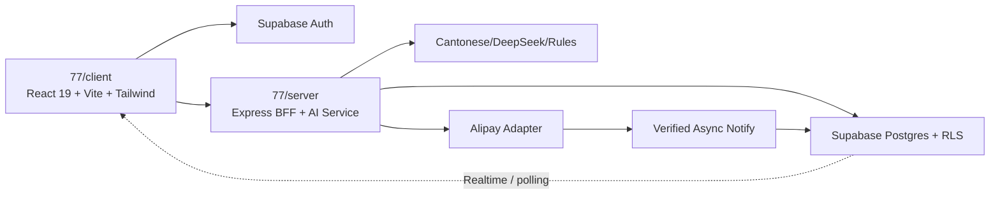

# SDD：77港话通 SaaS MVP

完整目标设计见 `..\..\开发日志\03-SPEC-77港话通社媒文案器-SaaS.md`。本文件是 Claude Code 的当前实现入口。

## 架构结论



- 唯一代码基线：`77`。
- `总览`：只复用登录页视觉、Supabase/RLS/审计模式；不复用报销领域表和路由。
- 浏览器不可信：不能决定角色、任务归属、金额、额度或支付成功。
- Express BFF：校验 Supabase JWT、权限、额度、输入、幂等键和对象归属。
- 支付成功：只由验签后的异步通知写入业务数据库。

## 路由与页面

### 公开

`/`、`/pricing`、`/login`、`/signup`、`/forgot-password`、`/reset-password`、`/auth/callback`、`/billing/success`、`/billing/cancel`

### 用户

`/app`、`/app/generate`、`/app/history`、`/app/history/:id`、`/app/favorites`、`/app/settings/profile`、`/app/settings/brand`、`/app/billing`

### 管理员

`/admin`、`/admin/users`、`/admin/generations`、`/admin/subscriptions`、`/admin/model-ops`、`/admin/settings`、`/admin/audit`、`/admin/admins`

## 前端设计系统与复用

- 事实源：`docs/design-system.md` 与现有工作台。
- 登录视觉来源：`D:\work\77港话通社媒文案\总览\src\routes\login.tsx`。
- 迁入：左右分栏、DarkVeil、标题、副标题、表单层级。
- 不迁入：管理员分配账号文案、邮箱域名白名单、Lovable OAuth、报销 Dashboard 跳转。
- 暗色：近黑 + 荧光绿；亮色：白 + 橙色。
- 组件：继续 Tailwind 和现有 shared primitives；正式路由/外部依赖安装前先获用户同意。

## MVP 数据模型

| 表 | 用途 | 关键边界 |
|---|---|---|
| `profiles` | 用户资料、注销计划 | 仅本人读写允许字段 |
| `user_roles` | user/admin/super_admin | 用户不能自升权 |
| `brand_profiles` | 品牌、语气、红线 | owner_id RLS |
| `saved_configs` | 工作台配置 | owner_id RLS |
| `generation_jobs` | 输入、状态、结果、错误、删除 | owner_id；正文软删除 |
| `favorites` | 收藏、评分、原因、参数 | owner_id RLS；幂等导入；UNIQUE(owner_id, client_id) |
| `plans` | Free/Pro 服务端配置 | 客户端只读公开字段 |
| `payment_orders` | 支付宝订单状态 | 服务端创建/更新 |
| `subscriptions` | 权益和有效期 | webhook/后台受控更新 |
| `usage_ledger` | 额度预占/消费/释放/调整 | append-only，幂等引用 |
| `webhook_events` | 通知去重和处理记录 | event/order 唯一键 |
| `audit_log` | 管理员访问与变更 | append-only，不允许管理员删除 |

`总览/supabase/migrations` 属于报销业务域，不得直接在 77 数据库执行。

## API 边界

- `POST /api/auth/*`：原则上使用 Supabase Auth；BFF 只做需要服务端控制的扩展。
- `POST /api/generations`：鉴权、限频、校验、额度预占、创建任务。
- `GET /api/generations`、`GET/DELETE /api/generations/:id`：严格按 owner/admin 授权。
- `POST /api/billing/checkout`：从服务端读取计划价格并创建订单。
- `POST /api/billing/alipay/notify`：读取原始参数、验签、金额/商户/订单校验、幂等更新。
- `GET /api/me/entitlements`：返回计划、额度和到期信息。
- `/api/admin/*`：服务端角色检查；高影响动作二次确认并审计。

## 生成迁移策略

1. Slice A/B 不改 AI Prompt 和生成协议。
2. Slice C 在现有同步调用外增加身份、任务落库、状态和结果持久化。
3. 同步持久化 MVP 稳定后，再把模型执行拆为 Worker/队列并使用 Realtime 或轮询恢复。
4. 额度流程：预占 → 成功消费；业务失败释放；未知超时进入 reconciliation，不能直接重复扣除。

## Auth 与安全控制

- Supabase 邮箱验证；公开注册默认 user。
- BFF 使用官方 JWT 验证/claims，不信任浏览器传入 user_id/role/plan。
- RLS + BFF 双层授权；必须有 User A/User B 隔离测试。
- 登录、生成和支付接口限频；服务端校验长度、枚举、对象归属和 overposting。
- CORS 仅允许正式/预览来源；生产开启 HTTPS、CSP、Secure/HttpOnly/SameSite Cookie（若使用 Cookie 会话）。
- Service Role、模型密钥、支付宝私钥只在服务端；证据中全部脱敏。
- `.env.example` 当前疑似包含真实值且处于用户修改状态；任何推送/部署前必须确认清理并轮换可能暴露密钥。

## UX-F1：生成进度 + Header 菜单收纳（2026-07-12 已完成）

### GenerationProgress 组件

- 位置：`client/src/components/results/GenerationProgress.tsx`
- 四阶段：诊断原文 → 生成变体 → 质量审核 → 消费者反馈
- 状态：pending (灰点) / active (脉冲色点) / done (勾) / failed (叉)
- 颜色：暗色 emerald-400/500；亮色 orange-500/600
- 标注：「预估阶段 · 实际耗时可能因 AI 响应速度而异」
- 类型：`GenerationStage`、`StageProgress`、`GenerationProgress`（见 types/index.ts）
- 动作：`SET_GENERATION_PROGRESS`、`ADVANCE_STAGE`、`CLEAR_PROGRESS`
- 进度为模拟估算（非真实 SSE）；useGenerate hook 在 API 调用中穿插 setTimeout 推进阶段

### HeaderMenu 组件

- 位置：`client/src/components/layout/HeaderMenu.tsx`
- 触发：汉堡菜单图标按钮，带 `aria-expanded` / `aria-haspopup`
- 菜单项：用户邮箱 → 官网首页 → 复原创作配置 → 主题切换 → 退出登录
- 关闭：Escape 键、点击外部、点击菜单项后
- 聚焦：关闭后返回触发按钮

### Header 重构

- 保留直接可见：Logo/标题、历史链接、收藏库按钮、引擎状态指示器
- 收纳到 HeaderMenu：官网导航、复原配置、主题切换、退出登录+邮箱

## Slice H1：用户反馈中心 + Server酱通知 + 收藏删除防误触（2026-07-12 已完成）

### 收藏删除确认对话框

- 组件：`client/src/components/shared/ConfirmDialog.tsx`
- shadcn-like 模式：role="alertdialog"、aria-modal、aria-labelledby、aria-describedby
- 键盘可访问：Escape 关闭、Tab 在取消/确认间循环、初始聚焦取消按钮
- 颜色：危险操作用红色（bg-red），默认用亮色橙色/暗色荧光绿
- 预览：可选文案摘要（截断 150 字符）
- FavoritesPanel 集成：点击删除按钮弹出确认对话框，取消不删除，确认才触发 REMOVE_BOOKMARK

### 反馈中心

- 入口：HeaderMenu → "意见反馈"（MessageSquare 图标）
- 组件：`client/src/components/feedback/FeedbackCenter.tsx`
- Panel 形式：右侧滑出 drawer（与 FavoritesPanel 同级渲染于 App.tsx）
- 类型：需求建议、Bug反馈、使用体验、其他（四选一 grid 按钮）
- 必填字段：标题（≤200 字符）、内容（≤5000 字符）、均有字符计数
- 自动附带：页面路径（window.location.pathname）、App 版本（0.1.0）
- 状态：提交中（loading spinner）、成功（绿色提示）、错误（红色提示）
- 我的反馈列表：GET /api/feedback，加载中/空状态/错误均有处理

### 服务端 API

- `POST /api/feedback`：requireAuth 保护，严格输入校验（类型/标题/内容/meta），持久化优先
- `GET /api/feedback`：requireAuth 保护，分页（limit 1-100, offset ≥0），仅返回自有反馈
- 通知流程：持久化成功 → best-effort Server酱通知 → 更新 notify_status（pending/sent/failed）
- 通知失败不回滚反馈数据，不改变 HTTP 状态码（始终 201）
- 反馈正文不写入普通 server log

### Server酱 Turbo 通知器

- 服务：`server/src/services/serverchanNotifier.ts`
- 接口：`Notifier` interface（send 方法），可注入 fetch 实现
- 实现：`ServerChanNotifier`（真实发送）、`NoopNotifier`（未配置时）
- 密钥加载：SERVERCHAN_SENDKEY env 直接优先 → SERVERCHAN_SENDKEY_FILE 文件指针
- 文件格式：raw key、`SendKey=...` 或 `SERVERCHAN_SENDKEY=...`（赋值名大小写不敏感；未知赋值名或多行内容拒绝加载）
- 错误脱敏：URL、异常信息、文件路径绝不包含 SendKey
- 超时：10 秒 AbortController
- 成功校验：errno===0 或 errno==='0'
- 工厂：`getNotifier()` 单例，`resetNotifier()` 测试用

### Migration（已推送并完成远端结构验收）

- 文件：`supabase/migrations/20260712072936_slice_h1_user_feedback.sql`
- 表：`public.user_feedback`（id, owner_id, type, title, content, metadata, notify_status, notify_attempts, notify_last_error, notified_at, created_at, updated_at）
- RLS：owner select/insert，admin/super_admin 通过 `private.has_any_role` select all，service_role full CRUD
- 用户不可写 notification 字段（WITH CHECK 守卫）
- 索引：owner+created_at desc、type、owner+created_at（防滥用查询）
- 远端版本：H1 Migration `20260712072936` 已通过认证 Supabase MCP 应用并完成结构验收

### 数据流

```
用户点击删除 → ConfirmDialog → 取消（关闭）/ 确认（REMOVE_BOOKMARK + 云同步删除）
用户提交反馈 → POST /api/feedback → validate → DB insert → 201
  → (异步) ServerChan.send() → update notify_status
  → 通知失败: 反馈数据不受影响
```

## Slice E：套餐/订单/支付 Mock（2026-07-12 已完成）

### 定价页 `/pricing`

- 组件：`client/src/pages/PricingPage.tsx`
- 公开访问，展示 Free（¥0，每滚动 7 天 20 次）与 Pro（¥19/月，每自然月 400 次）
- 每张卡片含：套餐名、价格、配额、功能列表、CTA 按钮、[MOCK] 标签
- FAQ 区：5 条常见问题
- 遵循设计系统：暗色 emerald、亮色 orange
- 顶部 MOCK banner：明确标注演示用途

### 结算页 `/app/billing`

- 组件：`client/src/pages/BillingPage.tsx`
- 受保护路由（requireAuth），显示当前套餐、使用进度条、周期信息
- 使用进度条颜色：绿（<70%）→ 黄（70-90%）→ 红（>90%）
- Free 用户显示"升级到 Pro"CTA，点击触发 Mock 结账流程
- 订单记录列表：加载中/空状态/错误/列表状态
- 订单状态标签：待支付（amber）、已支付（emerald）、已取消/已过期（gray）、失败（red）
- 顶部 [MOCK] banner 和底部内存存储提示
- 支持手动刷新

### 支付结果页 `/billing/success` 和 `/billing/cancel`

- 组件：`client/src/pages/BillingResultPage.tsx`
- 公开路由，通过 `outcome` prop 区分成功/取消
- 通过 orderId URL 参数获取订单详情
- 显示订单摘要（订单号、套餐、金额、状态）
- [MOCK] 标签和免责声明
- 返回结算页/工作台链接

### 服务端 Mock API

- 文件：`server/src/routes/billing.ts`
- `GET /api/me/entitlements` — requireAuth，返回 Mock 套餐权益
  - Free：quotaTotal=20，rolling 7-day cycle
  - Pro：quotaTotal=400，calendar month cycle
- `POST /api/billing/checkout` — requireAuth，创建 Mock 订单
  - 校验 planId（必须是 free 或 pro）
  - 拒绝 Free→Free（已在该套餐）
  - 拒绝 Pro→Free（MVP 不支持降级）
  - 返回 redirectUrl 指向 `/billing/success?orderId=...`
- `GET /api/billing/orders` — requireAuth，返回当前用户订单列表
- `GET /api/billing/orders/:id` — requireAuth，返回订单详情
  - 404：订单不存在
  - 403：订单不属于当前用户
- `GET /api/billing/plans` — 公开，返回套餐定义

### 类型系统（双向同步）

| 类型 | Client | Server |
|------|--------|--------|
| `PlanId` | ✅ | ✅ |
| `PlanInfo` | ✅ | ✅ |
| `PlanEntitlements` | ✅ | ✅ |
| `CheckoutRequest` | ✅ | ✅ |
| `CheckoutResponse` | ✅ | ✅ |
| `PaymentOrder` | ✅ | ✅ |
| `FREE_PLAN` / `PRO_PLAN` / `PLANS` 常量 | ✅ | ✅ |

### Header 导航

- 工作台 Header 新增"结算"链接（CreditCard 图标），直接访问 `/app/billing`

### Mock 安全边界

- 所有订单/权益数据存储在进程内存中（Map），重启清空
- 不读取 Supabase DB、不创建数据库 Migration
- 不调用真实支付宝、不发起真实支付
- 所有页面和 API 响应均含 `isMock: true` 标记
- `[MOCK]` 标签出现在所有定价/结算/支付结果页

## 当前切片 A 的实现边界

- 目标：正式路由 + 登录/注册/重置 Mock 壳 + 受保护 `/app` + 退出。
- 允许：清晰标记的 localStorage/mock session，仅用于前端流程验证。
- 禁止：生产 Supabase、数据库迁移、支付宝、真实角色/额度。
- 依赖新增必须先说明并获得用户同意。

## 兼容与回滚

- 不删除当前 pathname 分流，直到新路由的 `/` 与 `/app` 回归通过。
- 不改变现有 AppContext 生成状态；Auth 状态放独立 AuthProvider。
- Slice D 前的账户级 localStorage key 作为离线回退与可验证导入来源；云端同步成功后仍不得把归属不明的旧全局 key 静默归给当前账号。
- 每个切片单独提交；失败时回退该切片，不回退已有官网和工作台。
