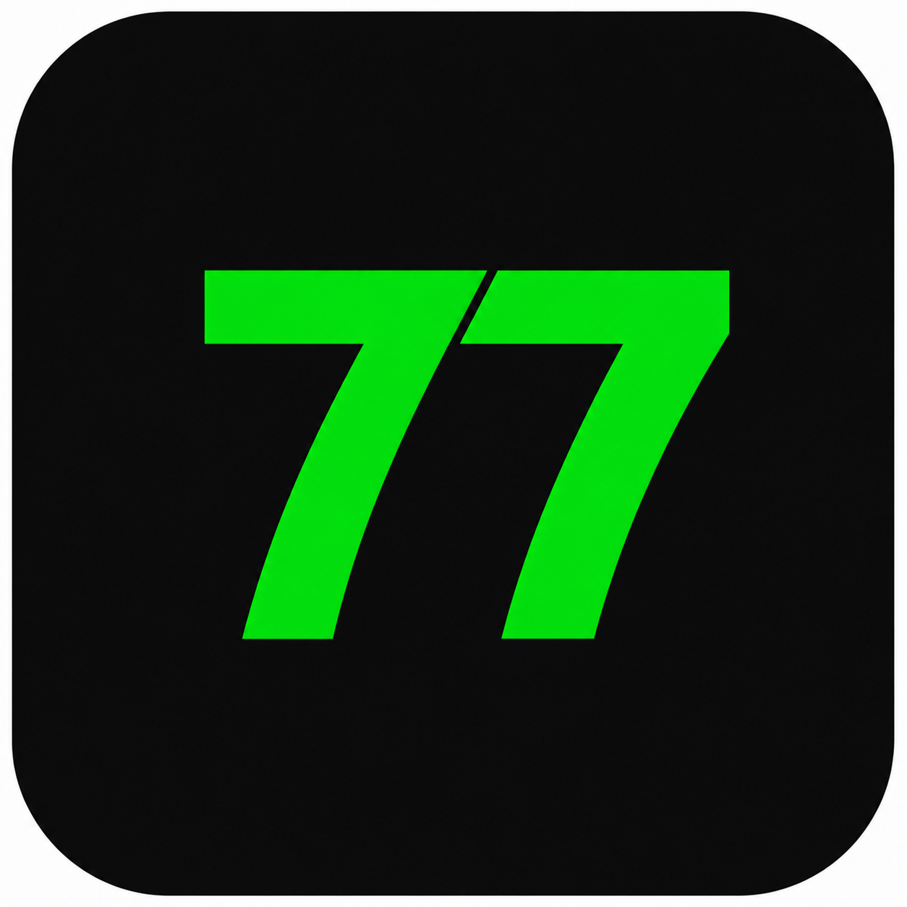

# Brand Spec — 77 港话通社媒文案器

> 设计稿与后续实现均须遵守。完整规范以 `docs/design-system.md` 为准。

## Logo

| 项 | 规则 |
| --- | --- |
| 正式路径 | `client/public/brand/77-logo.png` |
| 设计稿副本 | `前端设计稿/grok/assets/77-logo.png` |
| 内容 | 黑底 + 荧光绿「77」，用户确认资产 |
| 禁止 | 重画、CSS 仿制、改色、拉伸变形、产生白边 |
| 用法 | `` 放入黑底圆角容器；`object-cover` + 极轻微 scale 消除边缘缝 |

建议容器（与现 Header 一致）：

```html
<span class="logo-box">
  
</span>
```

```css
.logo-box {
  display: inline-flex;
  width: 32px;
  height: 32px;
  border-radius: 9px;
  overflow: hidden;
  background: #000;
}
.logo-box img {
  width: 100%;
  height: 100%;
  object-fit: cover;
  transform: scale(1.035);
}
```

## 双主题强调色

| 主题 | 品牌强调 | 表面层级 |
| --- | --- | --- |
| Dark | Emerald `emerald-300/400/500` | `gray-950` / `900` / `800` |
| Light | Orange `orange-700/600/500` + 浅橙表面 | 白 / `gray-100` / `gray-200` |

**硬规则**

- 不要把深色主题改成橙色主强调
- 不要在浅色主题继续用绿色作品牌强调
- 每个新增品牌强调类必须同时写 dark + light 对应项

## 语义色（不可冒充主品牌）

| 用途 | 色 |
| --- | --- |
| 收藏 / 评分 | Amber |
| 危险 / 删除 | Red |
| 低严重度信息 | Blue |

## 字体与密度

| 层级 | 建议 |
| --- | --- |
| 正文字号 | `14px` / `text-sm` |
| 辅助 | `12px` / `10px` |
| 字族 | 系统栈：`PingFang HK`, `Microsoft YaHei`, system-ui, sans-serif |
| 终端日志 | 等宽：`ui-monospace`, `SF Mono`, `Consolas`, monospace |
| 间距节奏 | 4px / 8px |
| 圆角 | 卡片/输入/面板以 `rounded-lg`（8px）为主；弹窗可 `rounded-xl` |

## 图标

- 新增结构性图标：Lucide 风格线框
- 本设计稿用内联 SVG 近似 Lucide，不引入新依赖
- 不顺手做全项目 emoji 重构；现有功能上的 emoji 可保留

## 终端视觉（生成进度）

| 主题 | 终端表面 | 活动光标 / 高亮 |
| --- | --- | --- |
| Dark | 深石墨 / 蓝黑 `#0b1220`–`#111827` | Emerald 光标与标签 |
| Light | 白 / 浅灰 | Orange 光标与标签 |

- 标签可用极少量语义色区分模块，**不建立紫色主品牌**
- 日志为用户可读阶段说明，由 `StageProgress.status` 推导
- 必须标注「预估流程」；禁止伪造 SSE、精确耗时、消息数、模型内部推理

## 弹窗（配额不足）

- 复用现有 `ConfirmDialog` 交互模式：`role="alertdialog"`、Escape 关闭、焦点在次按钮、点击遮罩不关闭
- 主按钮：充值 Pro（品牌强调色）
- 次按钮：暂不充值（中性）
- 不伪造支付成功

## 间距 / 组件密度目标

- 工具型：中栏结果优先，进度 UI 不抢结果位
- 加载态：中栏居中；宽屏可「进度条上 + 终端下」
- 不扩展为移动端重构（桌面优先三栏）
